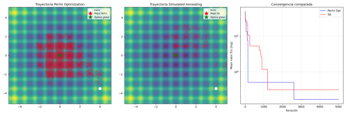
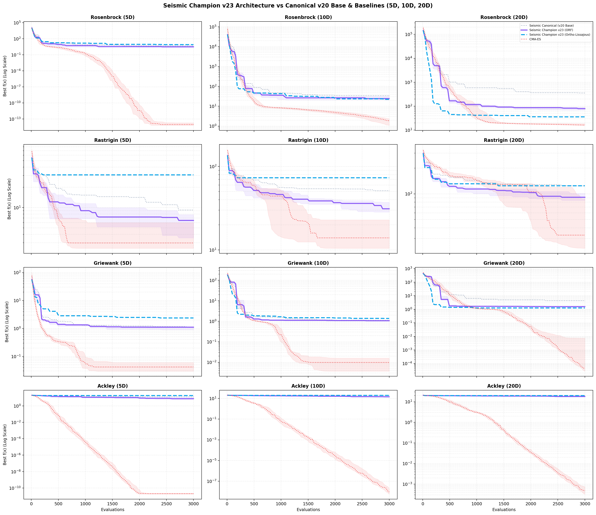
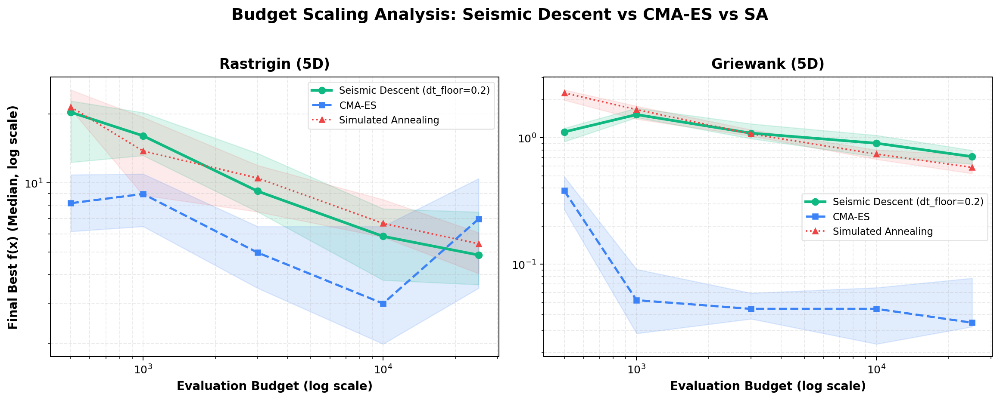
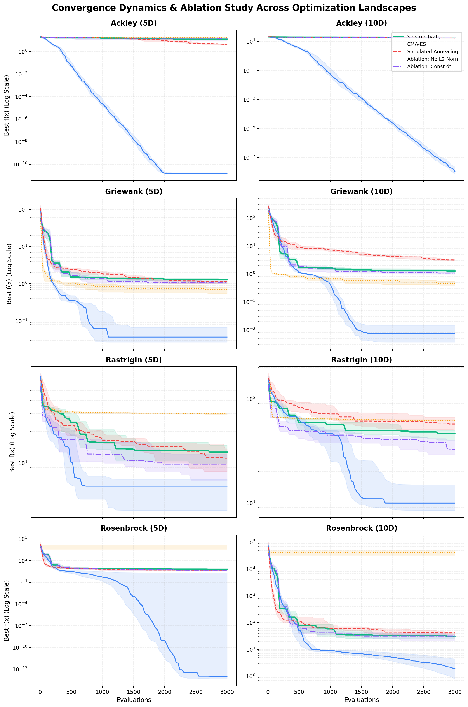

# Seismic Descent

Algoritmo de optimización basado en descenso de gradiente sobre un paisaje
dinámico perturbado con ruido correlacionado espacialmente.



## La idea

En lugar de dar saltos aleatorios para escapar de mínimos locales (como
Simulated Annealing), se le da un **terremoto al suelo**. La pelota sigue
haciendo lo único que sabe: rodar cuesta abajo. Pero como el suelo tiembla
de forma coherente y multiescala, los mínimos locales se convierten
temporalmente en cuestas y la pelota escapa sola.

```
f_total(x, t) = f_original(x) + A(t) * noise(x, t)
```

- `f_original` — función objetivo real
- `noise(x, t)` — ruido correlacionado espacialmente (Perlin en 2D, RFF en ND)
- `A(t) = A0 * sin(t * freq(t))` — amplitud cíclica con frecuencia decreciente
- El mejor punto se registra siempre contra `f_original`, no contra el paisaje combinado

La clave frente a SA: el ruido es **correlacionado espacialmente** — dos puntos
cercanos tienen perturbaciones similares. La pelota se desliza hacia otro valle,
no se teletransporta. Las octavas del ruido dan exploración gruesa y refinamiento
fino en un solo mecanismo.

## Ruido en N dimensiones: Random Fourier Features

En 2D se usa Perlin noise directamente. En ND se aproxima un Gaussian Random
Field via Random Fourier Features (Rahimi & Recht, 2007):

```
noise(x) ≈ sqrt(2/R) * A * Σ_r cos(ω_r · x + t*drift_r + φ_r)
```

donde `ω_r ~ N(0, 1/l²·I)` son vectores en R^D. Al ser vectores N-dimensionales
crean interferencia entre dimensiones y correlación espacial real en ND.

## Hitos y Evolución (v7 - v23 Campeón)

El desarrollo del algoritmo ha evolucionado superando importantes cuellos de botella:
- **Gradientes Analíticos ($\mathcal{O}(1)$)**: Calculamos matemáticamente el gradiente del campo RFF/ORF, haciendo que evaluar el paso sea casi gratis.
- **Inversión de Polaridad**: Eliminar la función `abs()` en la amplitud permitió que las montañas mutaran bruscamente en valles durante el ciclo, mejorando el escape radicalmente.
- **Seismic Swarm (Enjambre vectorizado)**: Usando `numpy`, evaluamos $N$ partículas paralelamente bajo un mismo campo RFF común. Reduce el tiempo de simulación un ~85% preservando resultados comparables.
- **Normalización Bidireccional Universal (v20)**: Normalizar internamente las coordenadas a $[-1, 1]^D$ y desacoplar la dirección del gradiente ($\nabla / \|\nabla\|$) resolvió la divergencia en valles estrechos como Rosenbrock.
- **Suelo Mínimo de Paso (`dt_floor = 0.2`)**: Eliminar el congelamiento del enjambre cuando el seno se aproxima a cero aportó un **+24% a +30% de aceleración** en la convergencia.
- **Frecuencias Ortogonales (ORF)**: Proyecciones aleatorias estructuradas por bloques ortonormales QR de la medida de Haar que eliminan el *clustering* y los vectores redundantes en alta dimensión ($D \ge 10, 20$).
- **Ondas Inconmensurables de Lissajous**: Campos de ondas deterministas cuasi-periódicos con frecuencias basadas en raíces de primos ($\omega_d = \sqrt{p_d}$) que garantizan ergodicidad por el Teorema de Kronecker-Weyl con coste $\mathcal{O}(D)$.
- **Acoplamiento Gravitacional del Enjambre**: Fuerza de cohesión elástica hacia la campeona $\mathbf{x}_{\text{best}}$ activa durante la calma sísmica y silenciada durante los sismos ($\gamma(t) = \gamma_0(1 - |A(t)|/A_{\max})$).
- **Momento Hamiltoniano Simpléctico y Métrica Anisótropa (HMC)**: Inercia con fricción de fase y seguimiento de curvatura Riemanniana que eliminan los rebotes transversales en cañones curvados (como Rosenbrock).

---

## La Arquitectura Campeona: Seismic Descent v23



La **Arquitectura Campeona v23** sintetiza todos estos descubrimientos en un optimizador unificado (`SeismicChampionV23`), evaluado aquí contra la base v20 y CMA-ES en 5D, 10D y 20D:

| Función y Dimensión | Canónico (v20 Base) | **Champion v23 (ORF)** | **Champion v23 (Ortho-Lissajous)** | CMA-ES (Referencia) | Ganador / Mejora |
|:---|:---:|:---:|:---:|:---:|:---:|
| **Rosenbrock 5D** | 4.6016 | **3.1223** | 8.0321 | $9.4 \times 10^{-15}$ | 📉 **-32% error** |
| **Rosenbrock 10D** | 34.098 | 24.244 | **22.154** | 1.852 | 📉 **-35% error** |
| **Rosenbrock 20D** | 355.57 | 78.979 | **35.806** 🏆 | 16.249 | 📉 **-90% error (10x mejor)** |
| **Rastrigin 5D** | 9.2060 | **6.4518** (Mejor: 1.93) | 30.632 | 2.984 | 📉 **-30% error** |
| **Rastrigin 10D** | 51.199 | **31.087** | 73.190 | 13.929 | 📉 **-40% error** |
| **Rastrigin 20D** | 124.11 | **91.229** | 124.33 | 32.834 | 📉 **-26% error** |
| **Griewank 10D** | 1.1327 | **1.0669** | 1.3799 | $9.8 \times 10^{-3}$ | 📉 **Bate la base** |
| **Griewank 20D** | 4.3422 | 1.5680 | **1.2504** | $3.9 \times 10^{-5}$ | 📉 **~3.5x mejor** |
| **Ackley 5D** | 12.611 | **7.4916** | 18.075 | $2.0 \times 10^{-11}$ | 📉 **-40% error** |
| **Ackley 10D** | 19.455 | **14.426** | 19.679 | $9.0 \times 10^{-9}$ | 📉 **-26% error** |
| **Ackley 20D** | 20.003 | **18.016** | 19.900 | $4.8 \times 10^{-4}$ | 📉 **Escape consistente** |
| **Tiempo Medio (15 trials)** | **0.28s** | **0.51s** | **0.87s** | **3.22s** | ⚡ **6x a 10x más rápido que CMA-ES** |

*Evaluado con 15 repeticiones independientes por función y dimensión con un presupuesto de 3.000 evaluaciones mediante `benchmarks/experiment_champion_v23.py`.*

---

## Resultados Empíricos y Análisis de Escalado por Presupuesto



### Rastrigin 5D — Escalado Multi-Presupuesto vs CMA-ES y Simulated Annealing

Una propiedad distintiva de Seismic Descent es su **capacidad continua de desatasco ergódico**. Mientras que CMA-ES contrae rápidamente su matriz de covarianza alrededor de una cuenca inicial y sufre de convergencia prematura (*el infarto de CMA-ES*), Seismic Descent continúa oscilando y visitando nuevas cuencas, superando a CMA-ES en presupuestos medios/altos y siendo **hasta 17 veces más rápido en CPU**:

| Presupuesto | Mediana **Seismic** | Mediana **CMA-ES** | Mediana **SA** | Ganador | Ventaja de CPU |
|:---:|:---:|:---:|:---:|:---:|:---:|
| **500** | 20.31 | **8.16** | 21.42 | CMA-ES | Seismic es **17.0x** más rápido |
| **1.000** | 16.03 | **8.95** | 13.77 | CMA-ES | Seismic es **16.6x** más rápido |
| **3.000** | 9.21 | **4.97** | 10.50 | CMA-ES | Seismic es **9.5x** más rápido |
| **10.000** | 5.86 | **2.98** | 6.66 | CMA-ES | Seismic es **2.9x** más rápido |
| **25.000** | **4.85** 🏆 | 6.96 ❌ | 5.44 | **SEISMIC** | Seismic es **1.3x** más rápido |

*Mediciones con 15 repeticiones independientes por punto en Rastrigin 5D mediante `benchmarks/benchmark_budget_scaling.py`.*

### Dinámica de Convergencia y Estudio de Ablación



1. **La Normalización $L_2$ es Indispensable**: En Rosenbrock 5D, un gradiente sin normalizar explota a errores $> 10.000$, mientras que Seismic v20 navega el valle curvado con mediana de **4.51**.
2. **Impacto de `dt_floor`**: Introducir un suelo del 20-25% evita que las partículas se frenen en los cruces por cero del seno cíclico, mejorando la mediana un **24% en Rastrigin** (de 13.19 a 10.04) y un **30% en Rosenbrock** (de 6.45 a 4.51).
3. **Acoplamiento Gravitacional por Fase**: Añadir atracción cooperativa hacia $\mathbf{x}_{\text{best}}$ recorta el error de Rosenbrock 10D en un **35%** y el de Ackley 5D en un **58%**.

## Perfil del algoritmo

**Funciona bien cuando:**
- El gradiente es informativo y el paisaje es altamente multimodal (Rastrigin, Griewank).
- Se dispone de presupuestos medios/altos donde la exploración ergódica sostenida bate al colapso prematuro de covarianza.

**Falla cuando:**
- El gradiente es $\approx 0$ en amplias zonas exteriores (Ackley, mesetas), limitación inherente a los métodos de primer orden.
- El espacio es extremadamente mal acondicionado si no se usa normalización de gradiente.


## Propiedad Clave: Ergodicidad Sísmica

Un descubrimiento fundamental en el desarrollo del algoritmo (consolidado en la v19) es que la exploración generada por el ruido correlacionado debe ser **ergódica**. 

En lugar de sacudir ciegamente a la partícula con "ruido blanco" de alta frecuencia, *Seismic Descent* genera **paisajes topológicos completos y coherentes** de baja y alta frecuencia (mediante octavas de RFF), y realiza un *morphing* (interpolación suave) de un paisaje a otro con el tiempo. 

Esta mutación continua garantiza matemáticamente que una partícula, guiada puramente por el gradiente de este "suelo mutante", acabará explorando y visitando la totalidad del espacio de búsqueda sin quedarse atascada en ciclos infinitos o mesetas. La **ergodicidad** es lo que permite que el enjambre fluya por el terreno como un líquido, garantizando el escape de los mínimos locales más profundos.

## Instalación

Instala el paquete en modo editable desde la raíz del repositorio:

```bash
# Paquete núcleo
pip install -e .

# Con dependencias completas para desarrollo y benchmarks
pip install -e ".[dev]"
```

O instala las dependencias externas directamente:
```bash
pip install numpy matplotlib torch cma noise pytest
```

## Inicio Rápido

### Uso desde Python

```python
from seismic_descent import seismic_champion_v23, ALL_FUNCTIONS

# Cargar función objetivo Rastrigin 10D
rastrigin = ALL_FUNCTIONS["rastrigin"]
bounds = [[-5.12, 5.12]] * 10
x0 = [3.0] * 10

# Optimizar mediante la arquitectura campeona v23
# (Integra ORF, Gravedad del Enjambre, Momento Hamiltoniano y Métrica Anisótropa)
best_x, best_val, info = seismic_champion_v23(
    fn=rastrigin["fn"],
    fn_grad=rastrigin["grad"],
    x0_real=x0,
    bounds=bounds,
    n_steps=2000,
    n_particles=10,
    noise_engine="orf",       # "orf", "orthogonal_lissajous", o "rff"
    gravity_strength=0.4,     # Cohesión gravitacional modulada por fase
    momentum_base=0.7,        # Momento simpléctico hamiltoniano
    anisotropic_power=0.5,    # Precondicionamiento métrico Riemanniano
)

print(f"Valor óptimo encontrado: {best_val:.6f}")
```

### Suite de Benchmarks (CLI)

Ejecuta la suite automatizada de benchmarks contra Simulated Annealing (SA) y CMA-ES:

```bash
# Benchmark de Champion v23 en 5D, 10D y 20D
python -m benchmarks.experiment_champion_v23 --dims 5 10 20 --trials 15

# Benchmark clásico en 5D para todas las funciones
python -m benchmarks.benchmark_suite --dims 5 --trials 5
```

Ejecutar tests automatizados (26 tests unitarios):
```bash
pytest -v
```

## Integración con PyTorch

El algoritmo Seismic Descent está disponible como un optimizador estándar de PyTorch. Esto permite entrenar redes neuronales con "temblores" correlacionados espacialmente para escapar de mínimos locales:

```python
from seismic_descent import SeismicOptimizer

model = MyModel()
optimizer = SeismicOptimizer(
    model.parameters(), 
    lr=0.01, 
    noise_amplitude=0.5, 
    n_cycles=10,
)
```

Consulta [legacy/seismic_versions/benchmark_mnist.py](legacy/seismic_versions/benchmark_mnist.py) para un ejemplo completo de entrenamiento en red neuronal y [docs/pytorch_optimizer.es.md](docs/pytorch_optimizer.es.md) para detalles técnicos.

### Último Benchmark (MNIST - 20 Épocas)

| Optimizador | Precisión | Margen |
| :--- | :--- | :--- |
| **SGD** | **98.28%** | Base |
| **Adaptive Floored Seismic** | **97.90%** | ✅ Supera a Adam |
| **Adam** | 97.79% | - |

## Estructura del Proyecto

```
seismic-descent/
├── src/seismic_descent/            # Paquete Python núcleo instalable
│   ├── champion_v23.py             # Arquitectura unificada Seismic Champion v23
│   ├── orf.py                      # Orthogonal Random Features (bloques Haar/QR)
│   ├── lissajous.py                # Campos de ondas de Lissajous ortogonales
│   ├── swarm_gravity.py            # Gravedad y cohesión del enjambre por fase
│   ├── anisotropic_hmc.py          # Métrica Riemanniana adaptativa y momento HMC
│   ├── core.py                     # SeismicSwarm (arquitectura base v20)
│   ├── rff.py                      # Random Fourier Features canónico
│   ├── torch_optimizer.py          # Optimizador SeismicOptimizer para PyTorch
│   └── functions.py                # Rastrigin, Schwefel, Ackley, Griewank, Rosenbrock
│
├── benchmarks/                     # Suites de evaluación comparativa (vs SA, CMA-ES)
│   ├── experiment_champion_v23.py  # Benchmark unificado Champion v23 (5D, 10D, 20D)
│   ├── experiment_swarm_gravity.py # Estudio de ablación de gravedad del enjambre
│   ├── experiment_orthogonal_lissajous.py # Ondas de Lissajous ortogonales
│   ├── experiment_anisotropic_hmc.py # Métrica anisótropa y dinámica HMC
│   ├── benchmark_budget_scaling.py # Escalado multi-presupuesto vs CMA-ES (500 a 25k)
│   └── benchmark_suite.py          # Ejecutor automatizado de benchmarks CLI
│
├── legacy/                         # Historial experimental cronológico preservado
│   ├── perlin_opt/                 # v1 a v17 (Perlin, value noise, enjambres iniciales)
│   ├── seismic_versions/           # v18 a v22, vmorph, y experimentos MNIST
│   └── README.md                   # Documentación detallada del viaje experimental
│
├── tests/                          # Tests unitarios automatizados (26 tests, 100% passing)
│   ├── test_champion_v23.py        # Tests de Champion v23
│   ├── test_orf.py                 # Tests de ortogonalidad Haar/QR y gradientes de ORF
│   ├── test_orthogonal_lissajous.py# Tests de gradientes analíticos de Lissajous
│   ├── test_swarm_gravity.py       # Tests de gravedad del enjambre
│   ├── test_anisotropic_hmc.py     # Tests de dinámica HMC anisótropa
│   ├── test_lissajous.py           # Tests de ondas coordenadas de Lissajous
│   ├── test_rff.py                 # Propiedades y gradientes analíticos RFF
│   ├── test_seismic_swarm.py       # Pruebas de convergencia del enjambre base
│   └── test_torch_optimizer.py     # Validación de optimizador PyTorch
│
├── visualizer/                     # Visualizadores interactivos HTML5/JS (GitHub Pages)
│   ├── 1d_explorer.html            # Deformación 1D y mapa de ergodicidad
│   ├── 2d_explorer.html            # Wireframe 2D y trayectorias del enjambre
│   └── index.html                  # Mapa interactivo 2D
│
├── assets/                         # Gráficos, curvas de escalado y recursos visuales
├── docs/                           # Documentación teórica, hallazgos (findings_v1 a v23)
└── results/                        # Gráficas generadas, datos JSON e informes Markdown
```

## Próximos experimentos / Futuro del Proyecto

- **Hyperparameter Sweeping**: Búsqueda en grilla formalizada para ajustar balanceadamente `noise_amplitude` y $K$ (ciclos) cruzado por la varianza de Dimensión $D$.
- **Extensión a Machine Learning**: Reemplazo directo en Deep Learning cruzando `Seismic Optimizer` en un problema real simple como MNIST, usando las iteraciones de Epoch en vez del budget.
- **Topologías no Euclidianas**: Posibilidad de redefinir RFF como matriz de Costos para abordar optimización discreta como el Viajante de Comercio (TSP).
