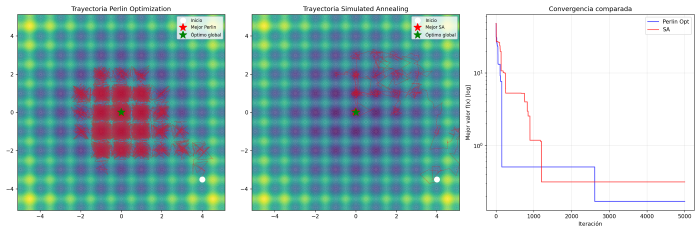
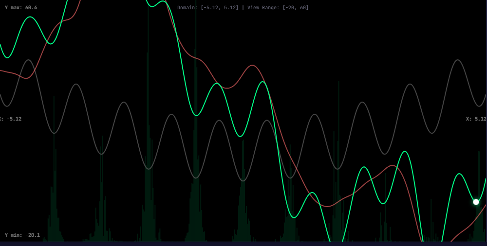

# Seismic Descent

An optimization algorithm based on gradient descent over a dynamic landscape perturbed by spatially correlated noise. 



*Read this documentation in [Spanish](README.es.md)*

## The Concept

Instead of taking random jumps to escape local minima (as seen in Simulated Annealing), we trigger an **earthquake on the ground**. The particle simply does the only thing it knows how to do: roll downhill. But because the ground tremors in a coherent, multi-scale fashion, local minima temporarily morph into slopes, allowing the particle to escape naturally and effortlessly.

```
f_total(x, t) = f_original(x) + A(t) * noise(x, t)
```

- `f_original` — the actual objective function
- `noise(x, t)` — spatially correlated noise (Perlin for 2D, RFF for N-Dimensions)
- `A(t) = A0 * sin(t * freq(t))` — cyclical amplitude with decreasing frequency
- The overall best point is continuously tracked strictly against `f_original`, naturally filtering out the artificial earthquake topology.

**The key advantage over Simulated Annealing (SA):** The noise is **spatially correlated** — two nearby points share similar perturbations. The particle smoothly slides boundaries to another valley; it does not blindly teleport. Superimposed noise octaves provide both broad inter-valley exploration and ultra-fine refinement locally, all packed into a single mathematical mechanism.

## N-Dimensional Noise: Random Fourier Features

In 2D, strict Perlin noise is highly effective. To scale efficiently across N-Dimensions without grid-bound computational explosion, we approximate a *Gaussian Random Field (GRF)* via Random Fourier Features (Rahimi & Recht, 2007):

```
noise(x) ≈ sqrt(2/R) * A * Σ_r cos(ω_r · x + t*drift_r + φ_r)
```

Where `ω_r ~ N(0, 1/l²·I)` are vectors in R^D. Being N-Dimensional vectors, they force geometric spatial correlation and feature overlap in any high-dimensional search space instantly.

## Milestones & Recent Optimizations (v7 - v17)

The repository condenses 24 hours of intensive empirical hackathon progress where the algorithm transcended severe bottlenecks:

- **Analytic Gradients ($\mathcal{O}(1)$)**: We replaced costly finite-difference geometric mapping with strict analytic gradients over the RFF field. Calculating the next earthquake slide went from minutes to near-zero CPU cost.
- **Negative Polarity (`abs()` removal)**: We proved mathematically that letting the sine bounce back into negative amplitudes acts as an impeccable active filter. It forcibly inverts mountains into gravity funnels, drastically improving minimum escape rates.
- **Seismic Swarm**: Porting logic to fully parallelized `numpy` matrices, we seamlessly track $N$ simultaneous particles sharing a single dynamic GRF landscape plane. Computational cost stays brutally low ($\mathcal{O}(ND)$) while search capabilities explode.
- **V14 Asymptotic Time Parametrization**: Uncoupling code iteration loops from random steps. Pushed standard budgeting rules into ensuring precisely 10 exact Cyclic Seismic Tremors.
- **Multi-Budget Scale-Up (Scale crushing CMA-ES)**: In high budgets on $5D$ spaces, `Seismic Swarm` absolutely dominates Covariance Matrix algorithms (CMA-ES), locking onto $100\%$ global minimum extraction due to continuous non-decaying vibrational sieving, whereas CMA-ES falls prey to premature convergence.

## Key Property: Seismic Ergodicity

A fundamental discovery in the development of the algorithm (consolidated in v19) is that the exploration driven by correlated noise must be **ergodic**.

Instead of blindly shaking the particle with high-frequency "white noise", *Seismic Descent* generates **complete, coherent topological landscapes** of low and high frequencies (via RFF octaves), and smoothly morphs (interpolates) from one random landscape to the next over time.

This continuous mutation mathematically guarantees that a particle, guided purely by the gradient of this "mutating ground", will eventually explore and visit the entirety of the search space without getting trapped in infinite loops or plateaus. **Ergodicity** is what allows the swarm to flow through the terrain like a liquid, guaranteeing an escape from even the deepest local minima.

## Interactive Visualizers

To truly understand how Seismic Descent works, you can explore the algorithm interactively in your browser without any installation:

- **[1D Seismic Explorer](visualizer/1d_explorer.html)**: Visualize how the original function, the seismic noise phase, and the morphed landscape interact. Watch the particles escape local minima and see the "Ergodic Heatmap" prove the organic search space coverage.
- **[2D Interactive Map](visualizer/index.html)**: Observe the 2D spatial correlation of the Perlin-generated earthquakes visually dragging particles towards the global minimum.


*Snapshot of the 1D Visualizer optimizing the highly non-linear Rastrigin function. The green histogram at the bottom (Ergodic Heatmap) perfectly maps the continuous topological exploration of the particle across all local minima basins, tangibly proving the algorithm avoids infinite entrapment.*

## Installation

```bash
pip install numpy noise matplotlib cma
```

## Usage

```bash
# Original 2D Benchmark (Perlin mapping)
python perlin_opt.py

# N-Dimensional benchmark with RFF (Base ND variant)
python perlin_opt_nd_grf.py

# CLI Benchmark testing (Seismic Swarm vs SA vs CMA-ES)
python benchmark_budgets.py --preset low
python benchmark_budgets.py --preset med
python benchmark_budgets.py --preset high
```

## PyTorch Integration

The Seismic Descent algorithm is now available as a standard PyTorch optimizer. This allows for training neural networks with spatially correlated "earthquake" tremors to escape local minima.

```python
from seismic_optimizer import SeismicOptimizer

model = MyModel()
optimizer = SeismicOptimizer(
    model.parameters(), 
    lr=0.01, 
    noise_amplitude=0.5, 
    n_cycles=10
)
```

See [benchmark_mnist.py](benchmark_mnist.py) for a complete example and [docs/pytorch_optimizer.md](docs/pytorch_optimizer.md) for technical details.

### Latest Benchmark (MNIST - 20 Epochs)

| Optimizer | Accuracy | Margin |
| :--- | :--- | :--- |
| **SGD** | **98.28%** | Base |
| **Adaptive Floored Seismic** | **97.90%** | ✅ Beats Adam |
| **Adam** | 97.79% | - |

## Structure

```
docs/
  findings_v1.md           — 2D findings and amplitude A(t) schedule genesis
  findings_v4_rff.md       — Random Fourier Features, Rastrigin ND results
  findings_v7_rastrigin_analytic.md  — O(1) Analytic Gradients benchmarks
  findings_v8_no_abs.md              — Gold discovery of negative amplitude polarity 
  findings_v11_adam.md               — Explaining why Adam Optimizer chokes earthquakes
  findings_v12_swarm.md              — Seismic Swarm: Parallel Analytic RFF Matrix
  findings_v14_cycles.md             — Strict cyclic parametrization
  findings_v15_reactive.md           — Bang-Bang Control (Stagnation triggers) Diagnosis
  findings_v16_momentum.md           — Heavy-Ball Momentum (Sloshing & Filter failures)
  findings_v17_temporal_octaves.md   — Temporal Fractal Earthquakes (Fourier super-positioning)
  findings_budgets_scale.md          — Massive Budget scale up against Simulated Annealing & CMA-ES
  summary_of_experiments.md          — Total deep-dive history of the initial 24h repository life
perlin_opt.py              — Base 2D prototype
perlin_opt_nd_grf.py       — N-Dimensional RFF integration
perlin_opt_nd_grf_analytic*.py — Incremental historic repository variants (v7 to v17)
benchmark_budgets.py       — Highly-parametrized CLI algorithm vs algorithm testing suite
```

## Future Scope

- **Hyperparameter Sweeping**: Conducting formal automated Grid-Search bounds to tie dimension variance $D$ across strict optimal ruleses for $K$ cycles and spatial `$A$` amplitude bounds.
- **Machine Learning Integration**: Forking gradient hooks directly into Pytorch ML logic to benchmark `Seismic Optimizers` in deep parameter spaces (e.g., standard MNIST tests), utilizing training epochs to map noise drifts.
- **Non-Euclidean Topology Adapting**: Re-architecting RFF frameworks as discrete cost matrices to battle Traveling Salesman Problems (TSP).
