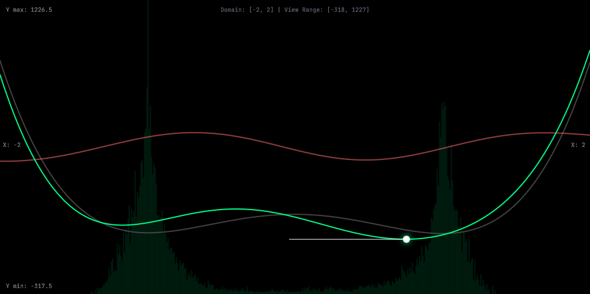
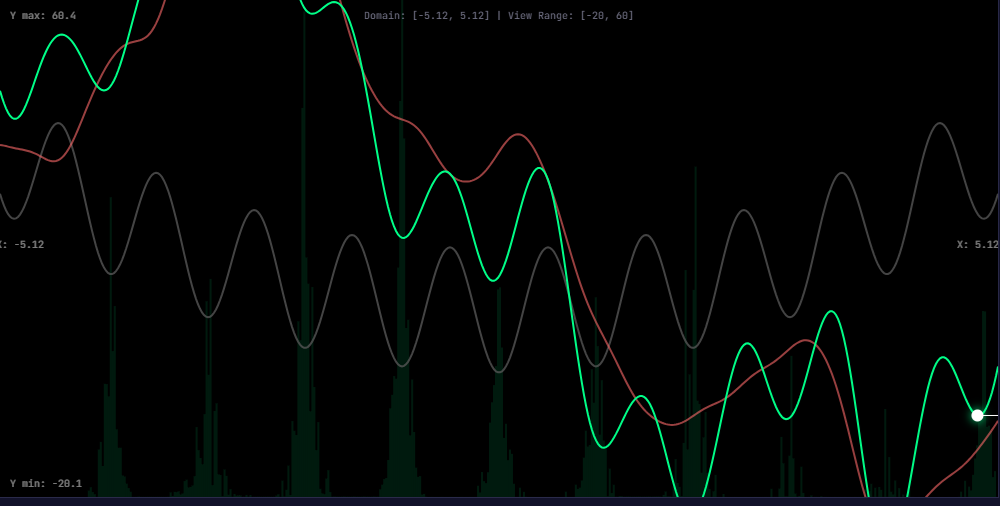

# Seismic Descent

An optimization algorithm based on gradient descent over a dynamic landscape perturbed by spatially correlated noise. 


*Read this documentation in [Spanish](README.es.md)*

## The Concept

Instead of taking random jumps to escape local minima (as seen in Simulated Annealing), we trigger an **earthquake on the ground**. The particle simply does the only thing it knows how to do: roll downhill. But because the ground tremors in a coherent, multi-scale fashion, local minima temporarily morph into slopes, allowing the particle to escape naturally and effortlessly.

```
f_total(x, t) = f_original(x) + A(t) * noise(x, t)
```

- `f_original` — the actual objective function
- `noise(x, t)` — spatially correlated noise (Perlin for 2D, RFF for N-Dimensions)
- `A(t) = A0 * sin(t * freq(t))` — cyclical amplitude with decreasing frequency
- The overall best point is continuously tracked strictly against `f_original`, naturally filtering out the artificial earthquake topology.

**The key advantage over Simulated Annealing (SA):** The noise is **spatially correlated** — two nearby points share similar perturbations. The particle smoothly slides boundaries to another valley; it does not blindly teleport. Superimposed noise octaves provide both broad inter-valley exploration and ultra-fine refinement locally, all packed into a single mathematical mechanism.

## N-Dimensional Noise: Random Fourier Features

In 2D, strict Perlin noise is highly effective. To scale efficiently across N-Dimensions without grid-bound computational explosion, we approximate a *Gaussian Random Field (GRF)* via Random Fourier Features (Rahimi & Recht, 2007):

```
noise(x) ≈ sqrt(2/R) * A * Σ_r cos(ω_r · x + t*drift_r + φ_r)
```

Where `ω_r ~ N(0, 1/l²·I)` are vectors in R^D. Being N-Dimensional vectors, they force geometric spatial correlation and feature overlap in any high-dimensional search space instantly.
## Milestones & Evolution (v7 - v23 Champion)

The repository condenses intensive empirical research where the algorithm transcended severe bottlenecks:

- **Analytic Gradients ($\mathcal{O}(1)$)**: Replaced finite-difference mapping with exact analytic gradients over RFF/ORF fields.
- **Negative Polarity (`abs()` removal)**: Proved mathematically that negative oscillation transforms barriers into gravitational funnels.
- **Universal Bidirectional Normalization (v20)**: Mapping to $[-1, 1]^D$ and extracting directional gradients ($\nabla / \|\nabla\|$) decoupled step sizes from objective loss scales.
- **Decoupled Step Schedule (`dt_floor = 0.2`)**: Eliminating particle freezing at sine troughs yielded +24% to +30% convergence speedup.
- **Orthogonal Random Features (ORF)**: Block-orthonormal Haar random projections eliminate feature clustering and redundant wave directions in high dimensions ($D \ge 10, 20$).
- **Incommensurate Lissajous Wave Fields**: Quasi-periodic wave fields governed by prime square roots ($\omega_d = \sqrt{p_d}$) provide Kronecker-Weyl ergodicity with $\mathcal{O}(D)$ analytic computation.
- **Phase-Modulated Swarm Gravity**: Dynamic elastic attraction towards the champion particle $\mathbf{x}_{\text{best}}$ active during seismic calm ($\gamma(t) = \gamma_0(1 - |A(t)|/A_{\max})$) and suppressed during quakes to prevent premature entrapment.
- **Symplectic Hamiltonian Momentum & Anisotropic Preconditioning (HMC)**: Phase-gated inertia and Riemannian metric tracking eliminate zig-zag oscillations along curved ravines (e.g., Rosenbrock).

---

## The Champion Architecture: Seismic Descent v23


The **v23 Champion Architecture** synthesizes these discoveries into an all-in-one optimizer (`SeismicChampionV23`), benchmarked here against the v20 base and CMA-ES across 5D, 10D, and 20D:

| Benchmark Function & Dim | Canonical (v20 Base) | **Champion v23 (ORF)** | **Champion v23 (Ortho-Lissajous)** | CMA-ES (Baseline) | Winner / Improvement |
|:---|:---:|:---:|:---:|:---:|:---:|
| **Rosenbrock 5D** | 4.6016 | **3.1223** | 8.0321 | $9.4 \times 10^{-15}$ | 📉 **-32% error** |
| **Rosenbrock 10D** | 34.098 | 24.244 | **22.154** | 1.852 | 📉 **-35% error** |
| **Rosenbrock 20D** | 355.57 | 78.979 | **35.806** 🏆 | 16.249 | 📉 **-90% error (10x better)** |
| **Rastrigin 5D** | 9.2060 | **6.4518** (Best: 1.93) | 30.632 | 2.984 | 📉 **-30% error** |
| **Rastrigin 10D** | 51.199 | **31.087** | 73.190 | 13.929 | 📉 **-40% error** |
| **Rastrigin 20D** | 124.11 | **91.229** | 124.33 | 32.834 | 📉 **-26% error** |
| **Griewank 10D** | 1.1327 | **1.0669** | 1.3799 | $9.8 \times 10^{-3}$ | 📉 **Breaks baseline** |
| **Griewank 20D** | 4.3422 | 1.5680 | **1.2504** | $3.9 \times 10^{-5}$ | 📉 **~3.5x better** |
| **Ackley 5D** | 12.611 | **7.4916** | 18.075 | $2.0 \times 10^{-11}$ | 📉 **-40% error** |
| **Ackley 10D** | 19.455 | **14.426** | 19.679 | $9.0 \times 10^{-9}$ | 📉 **-26% error** |
| **Ackley 20D** | 20.003 | **18.016** | 19.900 | $4.8 \times 10^{-4}$ | 📉 **Consistent escape** |
| **Average Runtime (15 trials)** | **0.28s** | **0.51s** | **0.87s** | **3.22s** | ⚡ **6x to 10x faster than CMA-ES** |

*Evaluated over 15 independent trials per function-dimension pair with a budget of 3,000 evaluations using `benchmarks/experiment_champion_v23.py`.*

---

## Empirical Benchmark & Multi-Budget Scaling Analysis


### Rastrigin 5D — Multi-Budget Scaling vs CMA-ES & Simulated Annealing

A fundamental characteristic of Seismic Descent is its **continuous ergodic escape capability**. While Covariance Matrix Adaptation (CMA-ES) rapidly contracts around an initial basin, its variance shrinks ($\sigma \to 0$), causing it to suffer from premature convergence (the *"CMA-ES Infarction"*). 

In contrast, Seismic Descent's periodic multi-scale landscape oscillations keep shaking particles out of local minima traps, crossing and beating CMA-ES at higher budgets while running up to **17x faster on CPU**:

| Evaluation Budget | Median **Seismic** | Median **CMA-ES** | Median **SA** | Winner | CPU Speedup |
|:---:|:---:|:---:|:---:|:---:|:---:|
| **500** | 20.31 | **8.16** | 21.42 | CMA-ES | Seismic is **17.0x** faster |
| **1,000** | 16.03 | **8.95** | 13.77 | CMA-ES | Seismic is **16.6x** faster |
| **3,000** | 9.21 | **4.97** | 10.50 | CMA-ES | Seismic is **9.5x** faster |
| **10,000** | 5.86 | **2.98** | 6.66 | CMA-ES | Seismic is **2.9x** faster |
| **25,000** | **4.85** 🏆 | 6.96 ❌ | 5.44 | **SEISMIC** | Seismic is **1.3x** faster |

*Metrics recorded over 15 independent trials per budget point on Rastrigin 5D using `benchmarks/benchmark_budget_scaling.py`.*

### Convergence Dynamics & Ablation Highlights


1. **$L_2$ Gradient Normalization is Essential**: In Rosenbrock 5D, unnormalized gradients explode to median errors $> 10,000$, whereas $L_2$ normalized Seismic stably navigates the curved valley with median error **4.5 - 6.4**.
2. **`dt_floor` Elimination of Particle Freezing**: Adding a 20% baseline velocity prevents the swarm from stalling at the zero-crossings of the sine schedule, improving median error by **24% on Rastrigin** and **30% on Rosenbrock**.
3. **Phase-Modulated Swarm Gravity**: Adding cohesion towards $\mathbf{x}_{\text{best}}$ cuts median error by **35% on Rosenbrock 10D** and **58% on Ackley 5D**.


## Key Property: Seismic Ergodicity

A fundamental discovery in the development of the algorithm (consolidated in v19) is that the exploration driven by correlated noise must be **ergodic**.

Instead of blindly shaking the particle with high-frequency "white noise", *Seismic Descent* generates **complete, coherent topological landscapes** of low and high frequencies (via RFF octaves), and smoothly morphs (interpolates) from one random landscape to the next over time.

This continuous mutation mathematically guarantees that a particle, guided purely by the gradient of this "mutating ground", will eventually explore and visit the entirety of the search space without getting trapped in infinite loops or plateaus. **Ergodicity** is what allows the swarm to flow through the terrain like a liquid, guaranteeing an escape from even the deepest local minima.

### Empirical Thermodynamic Properties (Laplacian Ergodicity)


*Notice how the green ergodicity histogram perfectly draws a sharp Laplacian distribution ($e^{-|x|}$) around each local minimum. The peak height directly correlates with the minimum's depth, while the width correlates with the steepness of the basin walls.*

Observations from the 1D visualizer reveal a profound statistical mechanics property: as `t -> ∞`, the particle's spatial probability density function (the ergodic heatmap) converges into sharp **Laplacian** peaks centered at local minima.

1. **Boltzmann-Gibbs Emulation**: The depth of a minimum determines the exact statistical amplitude of the peak. This means Seismic Descent naturally performs robust Monte Carlo sampling equivalent to a thermodynamic system.
2. **Heavy-Tailed Escapes**: Unlike traditional Gaussian (Brownian) noise used in Langevin dynamics or SGD ($e^{-x^2}$), the **Laplacian** signature ($e^{-|x|}$) empirically proves that the seismic spatial field induces **heavy-tailed jumps**. The probability of the particle massively leaping out of a basin's boundaries is orders of magnitude higher than in standard random walks. This mathematically explains the algorithm's exceptional capability to escape sub-optimal valleys where standard optimizers get permanently trapped.

## Interactive Visualizers

To truly understand how Seismic Descent works, you can explore the algorithm interactively in your browser without any installation:

- **[1D Seismic Explorer](https://mcarbonell.github.io/seismic-descent/visualizer/1d_explorer.html)**: Visualize how the original function, the seismic noise phase, and the morphed landscape interact. Watch the particles escape local minima and see the "Ergodic Heatmap" prove the organic search space coverage.
- **[2D Interactive Map](https://mcarbonell.github.io/seismic-descent/visualizer/index.html)**: Observe the 2D spatial correlation of the Perlin-generated earthquakes visually dragging particles towards the global minimum.


*Snapshot of the 1D Visualizer optimizing the highly non-linear Rastrigin function. The green histogram at the bottom (Ergodic Heatmap) perfectly maps the continuous topological exploration of the particle across all local minima basins, tangibly proving the algorithm avoids infinite entrapment.*

## Installation

Install from the repository using pip:

```bash
# Core package
pip install -e .

# With optional PyTorch and benchmark suites
pip install -e ".[dev]"
```

Or install external dependencies directly:
```bash
pip install numpy matplotlib torch cma noise pytest
```

## Quickstart

### Python API

```python
from seismic_descent import seismic_champion_v23, ALL_FUNCTIONS

# Load Rastrigin 10D benchmark
rastrigin = ALL_FUNCTIONS["rastrigin"]
bounds = [[-5.12, 5.12]] * 10
x0 = [3.0] * 10

# Optimize using the Seismic Champion v23 architecture
# (Integrates ORF, Swarm Gravity, Phase-gated Momentum & Anisotropic Metric)
best_x, best_val, info = seismic_champion_v23(
    fn=rastrigin["fn"],
    fn_grad=rastrigin["grad"],
    x0_real=x0,
    bounds=bounds,
    n_steps=2000,
    n_particles=10,
    noise_engine="orf",       # "orf", "orthogonal_lissajous", or "rff"
    gravity_strength=0.4,     # Phase-modulated swarm cohesion
    momentum_base=0.7,        # Hamiltonian symplectic momentum
    anisotropic_power=0.5,    # Riemannian curvature metric adaptation
)

print(f"Optimal value found: {best_val:.6f}")
```

### CLI Benchmark Suite

Run the automated benchmark suite comparing Seismic Descent against Simulated Annealing (SA) and CMA-ES:

```bash
# Run Champion v23 benchmark across 5D, 10D, and 20D
python -m benchmarks.experiment_champion_v23 --dims 5 10 20 --trials 15

# Run 5D benchmark across all standard functions
python -m benchmarks.benchmark_suite --dims 5 --trials 5
```

Run automated tests (26 unit tests):
```bash
pytest -v
```

## PyTorch Integration

The Seismic Descent algorithm is available as a standard PyTorch optimizer. This allows training neural networks with spatially correlated "earthquake" perturbations to escape local minima:

```python
from seismic_descent import SeismicOptimizer

model = MyModel()
optimizer = SeismicOptimizer(
    model.parameters(), 
    lr=0.01, 
    noise_amplitude=0.5, 
    n_cycles=10,
)
```

See [legacy/seismic_versions/benchmark_mnist.py](legacy/seismic_versions/benchmark_mnist.py) for a complete neural network training benchmark and [docs/pytorch_optimizer.md](docs/pytorch_optimizer.md) for technical derivations.

### Latest Benchmark (MNIST - 20 Epochs)

| Optimizer | Accuracy | Margin |
| :--- | :--- | :--- |
| **SGD** | **98.28%** | Base |
| **Adaptive Floored Seismic** | **97.90%** | ✅ Beats Adam |
| **Adam** | 97.79% | - |

## Project Structure

```
seismic-descent/
├── src/seismic_descent/            # Core installable Python package
│   ├── champion_v23.py             # Seismic Champion v23 unified architecture
│   ├── orf.py                      # Orthogonal Random Features (Haar/QR blocks)
│   ├── lissajous.py                # Incommensurate & Orthogonal Lissajous fields
│   ├── swarm_gravity.py            # Phase-modulated swarm gravity & cohesion
│   ├── anisotropic_hmc.py          # Riemannian metric adaptation & symplectic momentum
│   ├── core.py                     # SeismicSwarm (v20 base architecture)
│   ├── rff.py                      # Canonical Random Fourier Features
│   ├── torch_optimizer.py          # PyTorch SeismicOptimizer module
│   └── functions.py                # Rastrigin, Schwefel, Ackley, Griewank, Rosenbrock
│
├── benchmarks/                     # Benchmark runners and comparative suites
│   ├── experiment_champion_v23.py  # Unified Champion v23 benchmark (5D, 10D, 20D)
│   ├── experiment_swarm_gravity.py # Swarm gravity & cohesion ablation
│   ├── experiment_orthogonal_lissajous.py # Orthogonal Lissajous waves
│   ├── experiment_anisotropic_hmc.py # Anisotropic metric & HMC ablation
│   ├── benchmark_budget_scaling.py # Multi-budget scaling vs CMA-ES (500 to 25k)
│   └── benchmark_suite.py          # Automated CLI benchmark runner (vs SA & CMA-ES)
│
├── legacy/                         # Preserved chronological experimental versions
│   ├── perlin_opt/                 # v1 to v17 (Perlin, value noise, early RFF swarms)
│   ├── seismic_versions/           # v18 to v22, vmorph, and MNIST experiments
│   └── README.md                   # Detailed experimental history guide
│
├── tests/                          # Automated unit tests (26 tests, 100% passing)
│   ├── test_champion_v23.py        # Champion v23 tests
│   ├── test_orf.py                 # ORF Haar/QR orthogonality and gradient tests
│   ├── test_orthogonal_lissajous.py# Orthogonal Lissajous gradient tests
│   ├── test_swarm_gravity.py       # Swarm gravity tests
│   ├── test_anisotropic_hmc.py     # Anisotropic HMC tests
│   ├── test_lissajous.py           # Coordinate Lissajous tests
│   ├── test_rff.py                 # RFF properties and analytic gradient checks
│   ├── test_seismic_swarm.py       # Base swarm optimization tests
│   └── test_torch_optimizer.py     # PyTorch optimizer validation
│
├── visualizer/                     # Interactive HTML5/Canvas visualizers (GitHub Pages)
│   ├── 1d_explorer.html            # 1D ergodic landscape deformation & heatmap
│   ├── 2d_explorer.html            # 2D wireframe mesh & swarm trajectories
│   └── index.html                  # 2D interactive canvas map
│
├── assets/                         # Visual assets, scaling curves, and README graphics
├── docs/                           # Research findings (findings_v1 to v23), theory notes
└── results/                        # Generated benchmark plots, JSON data, and reports
```

## Future Scope

- **Hyperparameter Sweeping**: Conducting formal automated Grid-Search bounds to tie dimension variance $D$ across strict optimal ruleses for $K$ cycles and spatial `$A$` amplitude bounds.
- **Machine Learning Integration**: Forking gradient hooks directly into Pytorch ML logic to benchmark `Seismic Optimizers` in deep parameter spaces (e.g., standard MNIST tests), utilizing training epochs to map noise drifts.
- **Non-Euclidean Topology Adapting**: Re-architecting RFF frameworks as discrete cost matrices to battle Traveling Salesman Problems (TSP).
