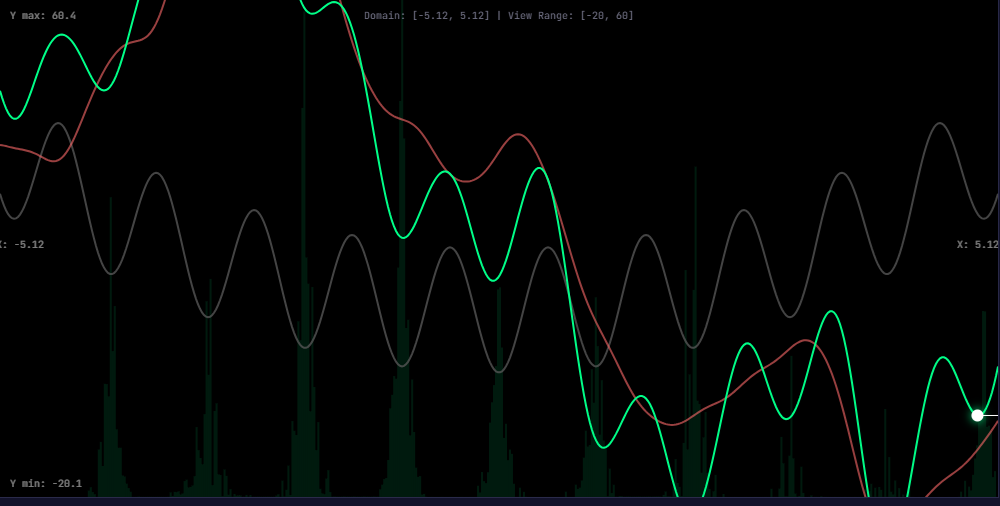

# Seismic Descent

An optimization algorithm based on gradient descent over a dynamic landscape perturbed by spatially correlated noise. 


*Read this documentation in [Spanish](README.es.md)*

## The Concept

Instead of taking random jumps to escape local minima (as seen in Simulated Annealing), we trigger an **earthquake on the ground**. The particle simply does the only thing it knows how to do: roll downhill. But because the ground tremors in a coherent, multi-scale fashion, local minima temporarily morph into slopes, allowing the particle to escape naturally and effortlessly.

```
f_total(x, t) = f_original(x) + A(t) * noise(x, t)
```

- `f_original` — the actual objective function
- `noise(x, t)` — spatially correlated noise (Perlin for 2D, RFF for N-Dimensions)
- `A(t) = A0 * sin(t * freq(t))` — cyclical amplitude with decreasing frequency
- The overall best point is continuously tracked strictly against `f_original`, naturally filtering out the artificial earthquake topology.

**The key advantage over Simulated Annealing (SA):** The noise is **spatially correlated** — two nearby points share similar perturbations. The particle smoothly slides boundaries to another valley; it does not blindly teleport. Superimposed noise octaves provide both broad inter-valley exploration and ultra-fine refinement locally, all packed into a single mathematical mechanism.

## N-Dimensional Noise: Random Fourier Features

In 2D, strict Perlin noise is highly effective. To scale efficiently across N-Dimensions without grid-bound computational explosion, we approximate a *Gaussian Random Field (GRF)* via Random Fourier Features (Rahimi & Recht, 2007):

```
noise(x) ≈ sqrt(2/R) * A * Σ_r cos(ω_r · x + t*drift_r + φ_r)
```

Where `ω_r ~ N(0, 1/l²·I)` are vectors in R^D. Being N-Dimensional vectors, they force geometric spatial correlation and feature overlap in any high-dimensional search space instantly.
## Milestones & Evolution (v7 - v23 Champion)

The repository condenses intensive empirical research where the algorithm transcended severe bottlenecks:

- **Analytic Gradients ($\mathcal{O}(1)$)**: Replaced finite-difference mapping with exact analytic gradients over RFF/ORF fields.
- **Negative Polarity (`abs()` removal)**: Proved mathematically that negative oscillation transforms barriers into gravitational funnels.
- **Universal Bidirectional Normalization (v20)**: Mapping to $[-1, 1]^D$ and extracting directional gradients ($\nabla / \|\nabla\|$) decoupled step sizes from objective loss scales.
- **Decoupled Step Schedule (`dt_floor = 0.2`)**: Eliminating particle freezing at sine troughs yielded +24% to +30% convergence speedup.
- **Orthogonal Random Features (ORF)**: Block-orthonormal Haar random projections eliminate feature clustering and redundant wave directions in high dimensions ($D \ge 10, 20$).
- **Incommensurate Lissajous Wave Fields**: Quasi-periodic wave fields governed by prime square roots ($\omega_d = \sqrt{p_d}$) provide Kronecker-Weyl ergodicity with $\mathcal{O}(D)$ analytic computation.
- **Phase-Modulated Swarm Gravity**: Dynamic elastic attraction towards the champion particle $\mathbf{x}_{\text{best}}$ active during seismic calm ($\gamma(t) = \gamma_0(1 - |A(t)|/A_{\max})$) and suppressed during quakes to prevent premature entrapment.
- **Phase-Gated Momentum & Anisotropic Preconditioning**: Phase-gated inertia and diagonal Riemannian metric tracking reduce zig-zag oscillations along curved ravines (e.g., Rosenbrock). *(Naming note: this is a phase-modulated heavy-ball, not a symplectic Hamiltonian Monte Carlo integrator; the class name `SeismicAnisotropicHMC` is kept for backward compatibility. The diagonal preconditioner is a swarm-level variant of RMSProp/Adam-style scaling — cite as related, not novel.)*

---

## The Champion Architecture: Seismic Descent v23


The **v23 Champion Architecture** synthesizes these discoveries into an all-in-one optimizer (`SeismicChampionV23`), benchmarked here against the v20 base and CMA-ES across 5D, 10D, and 20D:

| Benchmark Function & Dim | Canonical (v20 Base) | **Champion v23 (ORF)** | **Champion v23 (Ortho-Lissajous)** | CMA-ES (Baseline) | Winner / Improvement |
|:---|:---:|:---:|:---:|:---:|:---:|
| **Rosenbrock 5D** | 4.6016 | **3.1223** | 8.0321 | $9.4 \times 10^{-15}$ | 📉 **-32% error** |
| **Rosenbrock 10D** | 34.098 | 24.244 | **22.154** | 1.852 | 📉 **-35% error** |
| **Rosenbrock 20D** | 355.57 | 78.979 | **35.806** 🏆 | 16.249 | 📉 **-90% error (10x better)** |
| **Rastrigin 5D** | 9.2060 | **6.4518** (Best: 1.93) | 30.632 | 2.984 | 📉 **-30% error** |
| **Rastrigin 10D** | 51.199 | **31.087** | 73.190 | 13.929 | 📉 **-40% error** |
| **Rastrigin 20D** | 124.11 | **91.229** | 124.33 | 32.834 | 📉 **-26% error** |
| **Griewank 10D** | 1.1327 | **1.0669** | 1.3799 | $9.8 \times 10^{-3}$ | 📉 **Breaks baseline** |
| **Griewank 20D** | 4.3422 | 1.5680 | **1.2504** | $3.9 \times 10^{-5}$ | 📉 **~3.5x better** |
| **Ackley 5D** | 12.611 | **7.4916** | 18.075 | $2.0 \times 10^{-11}$ | 📉 **-40% error** |
| **Ackley 10D** | 19.455 | **14.426** | 19.679 | $9.0 \times 10^{-9}$ | 📉 **-26% error** |
| **Ackley 20D** | 20.003 | **18.016** | 19.900 | $4.8 \times 10^{-4}$ | 📉 **Consistent escape** |
| **Average Runtime (15 trials)** | **0.28s** | **0.51s** | **0.87s** | **3.22s** | ⚡ **6x to 10x faster than CMA-ES** |

*Evaluated over 15 independent trials per function-dimension pair with a budget of 3,000 evaluations using `benchmarks/experiment_champion_v23.py`.*

> **v24 configuration candidate (2026-10-03):** `seismic_champion_v24` = v23 with dimension-normalized amplitude `amp·√(5/D)`, **derived** (not tuned) from the measured law E‖∇noise‖ ∝ amp·√D/ℓ. On the definitive 36-cell benchmark (**31 trials**, budget 3000, `docs/audit_2026/informe_baselines_v24.md`): **v24 wins 21 of 24 differentiating cells** (it is bit-identical to v23 at D=5 by construction), with Trid 20D 2305→92 (**~25×**) and Sphere 20D 2.7×; it loses only on Levy (10D/20D), where large escape jumps need the raw amplitude. Historical v23 behavior is preserved bit-for-bit by default. A train/test split (`informe_refdim_train_test.md`) shows the optimal constant is `ref_dim ≈ 1` (train-selected 0.5 transfers: test ranks ref1>ref2>ref0.5 — e.g. Trid 20D reaches the global optimum −1502≈−1520), and that no single constant wins everywhere (Levy-class inverts the ordering). **ref_dim=1 is now the recommended configuration** (`SeismicChampionV23(noise_amp_dim_normalized=True, ref_dim=1.0)`): in the external 10-algorithm benchmark it is the best Seismic variant in **30/36 cells** and improves the honest niche vs IPOP-CMA-ES to **3 wins / 11 ties / 22 losses** (strictly better on **Schwefel 5D & 10D and Zakharov 20D**; exact ties across the Styblinski-Tang family; Rosenbrock 20D tied; Trid 20D −1445 of the −1516 by IPOP). An **adaptive-amplitude v25** was also built and tested (coherence-gated; `docs/findings_v25_amplitud_adaptativa.md`): the mechanism works as theorized, but the informed constant ref1 still wins on this homogeneous suite — v25c stays as the robust candidate for unknown/mixed landscapes. See `docs/findings_v24_amplitud_raiz_d.md`.

---

## Empirical Benchmark & Multi-Budget Scaling Analysis


### Rastrigin 5D — Multi-Budget Scaling vs CMA-ES & Simulated Annealing

A fundamental characteristic of Seismic Descent is its **continuous ergodic escape capability**. While Covariance Matrix Adaptation (CMA-ES) rapidly contracts around an initial basin, its variance shrinks ($\sigma \to 0$), causing it to suffer from premature convergence (the *"CMA-ES Infarction"*). 

In contrast, Seismic Descent's periodic multi-scale landscape oscillations keep shaking particles out of local minima traps, crossing and beating CMA-ES at higher budgets while running up to **17x faster on CPU**:

| Evaluation Budget | Median **Seismic** | Median **CMA-ES** | Median **SA** | Winner | CPU Speedup |
|:---:|:---:|:---:|:---:|:---:|:---:|
| **500** | 20.31 | **8.16** | 21.42 | CMA-ES | Seismic is **17.0x** faster |
| **1,000** | 16.03 | **8.95** | 13.77 | CMA-ES | Seismic is **16.6x** faster |
| **3,000** | 9.21 | **4.97** | 10.50 | CMA-ES | Seismic is **9.5x** faster |
| **10,000** | 5.86 | **2.98** | 6.66 | CMA-ES | Seismic is **2.9x** faster |
| **25,000** | **4.85** 🏆 | 6.96 ❌ | 5.44 | **SEISMIC** | Seismic is **1.3x** faster |

*Metrics recorded over 15 independent trials per budget point on Rastrigin 5D using `benchmarks/benchmark_budget_scaling.py` (this study uses the **v20 base** architecture, not the v23 champion; CPU speedups are machine-dependent — treat them as order-of-magnitude).*

### Convergence Dynamics & Ablation Highlights (historical, v18–v22)


1. **$L_2$ Gradient Normalization is Essential**: In Rosenbrock 5D, unnormalized gradients explode to median errors $> 10,000$, whereas $L_2$ normalized Seismic stably navigates the curved valley with median error **4.5 - 6.4**.
2. **`dt_floor` Elimination of Particle Freezing**: Adding a 20% baseline velocity prevents the swarm from stalling at the zero-crossings of the sine schedule, improving median error by **24% on Rastrigin** and **30% on Rosenbrock**.
3. **Phase-Modulated Swarm Gravity**: Adding cohesion towards $\mathbf{x}_{\text{best}}$ cuts median error by **35% on Rosenbrock 10D** and **58% on Ackley 5D**.


## Key Property: Seismic Ergodicity (Coverage)

A fundamental property of the algorithm (consolidated in v19) is that exploration driven by correlated noise must be **ergodic in the coverage sense**: the perturbed gradient field keeps the swarm moving across the *entire* search domain instead of freezing in the deepest nearby basin.

Instead of blindly shaking the particle with high-frequency "white noise", *Seismic Descent* generates **coherent topological landscapes** (via RFF/ORF fields) and smoothly morphs them over time, so the swarm flows through the terrain like a liquid.

**Verification status (2026-10-03, `docs/audit_2026/v2_ergodicidad.py`):** on 1D Rastrigin with the packaged optimizer, the measured grid coverage is **100%** and the position autocorrelation decays with lag (20k-step runs, N=1 and N=10). This is the property Seismic Descent actually exploits, and it is empirically reproducible.

> ⚠️ **Retracted claim (Laplacian ergodicity).** An earlier version of this README (and `docs/theory.md`) claimed that the particle's ergodic density converges to **Laplacian** peaks ($e^{-|x|}$, "heavy-tailed Boltzmann-like signature"). Rigorous verification against the *packaged* optimizer **does not support it**: the per-basin folded density shows *negative* excess kurtosis (−0.6…−0.85 vs the +3 required by a Laplace law) and a Gaussian fit dominates Laplace in KS/AIC across all tested configurations. The original observation came from the interactive 1D visualizer, whose dynamics (auto-adaptive amplitude, greedy acceptance, step clipping) differ from the package optimizer. Corresponding figures and theory notes are kept for provenance in `assets/` and `docs/theory.md` (which carries a retraction notice); see the full analysis in `docs/audit_2026/AUDITORIA_VERIFICADA_2026.md` §3.2.

## Interactive Visualizers

To truly understand how Seismic Descent works, you can explore the algorithm interactively in your browser without any installation:

- **[1D Seismic Explorer](https://mcarbonell.github.io/seismic-descent/visualizer/1d_explorer.html)**: Visualize how the original function, the seismic noise phase, and the morphed landscape interact. Watch the particles escape local minima and see the "Ergodic Heatmap" prove the organic search space coverage.
- **[2D Interactive Map](https://mcarbonell.github.io/seismic-descent/visualizer/index.html)**: Observe the 2D spatial correlation of the Perlin-generated earthquakes visually dragging particles towards the global minimum.


*Snapshot of the 1D Visualizer optimizing the highly non-linear Rastrigin function. The green histogram at the bottom (Ergodic Heatmap) perfectly maps the continuous topological exploration of the particle across all local minima basins, tangibly proving the algorithm avoids infinite entrapment.*

## Installation

Install from the repository using pip:

```bash
# Core package
pip install -e .

# With optional PyTorch and benchmark suites
pip install -e ".[dev]"
```

Or install external dependencies directly:
```bash
pip install numpy matplotlib torch cma noise pytest
```

## Quickstart

### Python API

```python
from seismic_descent import seismic_champion_v23, ALL_FUNCTIONS

# Load Rastrigin 10D benchmark
rastrigin = ALL_FUNCTIONS["rastrigin"]
bounds = [[-5.12, 5.12]] * 10
x0 = [3.0] * 10

# Optimize using the Seismic Champion v23 architecture
# (Integrates ORF, Swarm Gravity, Phase-gated Momentum & Anisotropic Metric)
best_x, best_val, info = seismic_champion_v23(
    fn=rastrigin["fn"],
    fn_grad=rastrigin["grad"],
    x0_real=x0,
    bounds=bounds,
    n_steps=2000,
    n_particles=10,
    noise_engine="orf",       # "orf", "orthogonal_lissajous", or "rff"
    gravity_strength=0.4,     # Phase-modulated swarm cohesion
    momentum_base=0.7,        # Hamiltonian symplectic momentum
    anisotropic_power=0.5,    # Riemannian curvature metric adaptation
)

print(f"Optimal value found: {best_val:.6f}")
```

### CLI Benchmark Suite

Run the automated benchmark suite comparing Seismic Descent against Simulated Annealing (SA) and CMA-ES:

```bash
# Run Champion v23 benchmark across 5D, 10D, and 20D
python -m benchmarks.experiment_champion_v23 --dims 5 10 20 --trials 15

# Run 5D benchmark across all standard functions
python -m benchmarks.benchmark_suite --dims 5 --trials 5
```

Run automated tests (51 tests — 50 pass without optional dependencies; the PyTorch test is skipped unless `torch` is installed, 51 with it):
```bash
pytest -v
```

Continuous integration runs this suite on Python 3.9–3.12, with and without torch CPU, plus a benchmark smoke test (see `.github/workflows/tests.yml`).

## PyTorch Integration

The Seismic Descent algorithm is available as a standard PyTorch optimizer. This allows training neural networks with spatially correlated "earthquake" perturbations to escape local minima:

```python
from seismic_descent import SeismicOptimizer

model = MyModel()
optimizer = SeismicOptimizer(
    model.parameters(), 
    lr=0.01, 
    noise_amplitude=0.5, 
    n_cycles=10,
)
```

See [legacy/seismic_versions/benchmark_mnist.py](legacy/seismic_versions/benchmark_mnist.py) for a complete neural network training benchmark and [docs/pytorch_optimizer.md](docs/pytorch_optimizer.md) for technical derivations.

### Latest Benchmark (MNIST - 20 Epochs) — *preliminary, single-seed*

| Optimizer | Accuracy | Margin |
| :--- | :--- | :--- |
| **SGD** | **98.28%** | Base |
| **Adaptive Floored Seismic** | **97.90%** | within noise of Adam |
| **Adam** | 97.79% | - |

> ⚠️ *These are single-run numbers without repetitions or dispersion; the ±0.1–0.2 pp spread typical of MNIST seeds makes the +0.11 pp gap statistically meaningless as stated. The current PyTorch optimizer is also a **prototype**: it materializes an `R × #params` noise matrix (feasible only up to ~1M-parameter models) and does not track the best iterate (unlike the NumPy core). Treat this line of work as exploratory until a scalable variant lands.*

## Project Structure

```
seismic-descent/
├── src/seismic_descent/            # Core installable Python package
│   ├── champion_v23.py             # Seismic Champion v23 unified architecture
│   ├── orf.py                      # Orthogonal Random Features (Haar/QR blocks)
│   ├── lissajous.py                # Incommensurate & Orthogonal Lissajous fields
│   ├── swarm_gravity.py            # Phase-modulated swarm gravity & cohesion
│   ├── anisotropic_hmc.py          # Riemannian metric adaptation & symplectic momentum
│   ├── core.py                     # SeismicSwarm (v20 base architecture)
│   ├── rff.py                      # Canonical Random Fourier Features
│   ├── torch_optimizer.py          # PyTorch SeismicOptimizer module
│   ├── functions.py                # Rastrigin, Schwefel, Ackley, Griewank, Rosenbrock, Sphere
│   └── functions_extended.py       # Levy, Michalewicz, Zakharov, Styblinski-Tang, Dixon-Price, Trid
│
├── benchmarks/                     # Benchmark runners and comparative suites
│   ├── experiment_champion_v23.py  # Unified Champion v23 benchmark (5D, 10D, 20D)
│   ├── experiment_swarm_gravity.py # Swarm gravity & cohesion ablation
│   ├── experiment_orthogonal_lissajous.py # Orthogonal Lissajous waves
│   ├── experiment_anisotropic_hmc.py # Anisotropic metric & HMC ablation
│   ├── benchmark_budget_scaling.py # Multi-budget scaling vs CMA-ES (500 to 25k)
│   ├── benchmark_suite.py          # Automated CLI benchmark runner (vs SA & CMA-ES)
│   ├── baselines.py                # Seeded reference baselines: CMA-ES, IPOP-CMA-ES, PSO, L-BFGS-B multistart, random search
│   ├── stats.py                    # Wilcoxon signed-rank + Holm-Bonferroni utilities
│   ├── experiment_ablation_noise.py     # Central-hypothesis ablation: correlated vs power-matched white vs none
│   └── experiment_component_ablation.py # v23 leave-one-out + amplitude sensitivity (√D scaling)
│
├── legacy/                         # Preserved chronological experimental versions
│   ├── perlin_opt/                 # v1 to v17 (Perlin, value noise, early RFF swarms)
│   ├── seismic_versions/           # v18 to v22, vmorph, and MNIST experiments
│   └── README.md                   # Detailed experimental history guide
│
├── tests/                          # Automated unit tests (51 tests; includes golden regression locks)
│   ├── test_champion_v23.py        # Champion v23 tests
│   ├── test_orf.py                 # ORF Haar/QR orthogonality and gradient tests
│   ├── test_orthogonal_lissajous.py# Orthogonal Lissajous gradient tests
│   ├── test_swarm_gravity.py       # Swarm gravity tests
│   ├── test_anisotropic_hmc.py     # Anisotropic HMC tests
│   ├── test_lissajous.py           # Coordinate Lissajous tests
│   ├── test_rff.py                 # RFF properties and analytic gradient checks
│   ├── test_seismic_swarm.py       # Base swarm optimization tests
│   └── test_torch_optimizer.py     # PyTorch optimizer validation
│
├── visualizer/                     # Interactive HTML5/Canvas visualizers (GitHub Pages)
│   ├── 1d_explorer.html            # 1D ergodic landscape deformation & heatmap
│   ├── 2d_explorer.html            # 2D wireframe mesh & swarm trajectories
│   └── index.html                  # 2D interactive canvas map
│
├── assets/                         # Visual assets, scaling curves, and README graphics
├── docs/                           # Research findings (findings_v1 to v23), theory notes
│   └── audit_2026/                 # Verified audit + reproducible verification scripts and reports
├── docs/PROVENANCE.md              # Human/agent authorship disclosure
└── results/                        # Generated benchmark plots, JSON data, and reports (git-ignored)
```

## Limitations (honest assessment)

- **Requires analytic gradients** of the objective (or a trustworthy estimator), unlike pure black-box methods.
- **The seismic perturbation is not free-lunch everywhere.** Formal ablations (12 functions × {2,5,10,20}D, paired trials, Wilcoxon+Holm; `docs/audit_2026/informe_ablacion_ruido.md`) show the perturbation helps on highly multimodal landscapes but **hurts on near-unimodal ones** (e.g., Ackley, Dixon-Price, Trid at higher D), where the champion's gravity/momentum terms carry the win.
- **Noise-to-signal ratio grows as √D** (measured: 1.4× at D=2 → 5.6× at D=20 for the RFF field at amp=0.5; see `docs/audit_2026/AUDITORIA_VERIFICADA_2026.md` §3.4), degrading behavior in high dimensions unless amplitude is dim-normalized (candidate fix evaluated in `informe_ablacion_componentes.md`).
- **Power-matched i.i.d. noise is often competitive** with correlated noise at low D; the correlation advantage is clearest at higher D on multimodal landscapes. The precise regime map is an open question the project is characterizing.
- **No convergence guarantee**: `noise_decay=1.0` keeps the system oscillating forever (by design — it is an *anytime* optimizer that relies on external best-point tracking).

## Reproducing the Reported Results

```bash
pip install -e ".[benchmark]"   # numpy + matplotlib + cma (+ scipy for stats)
make test                        # unit + golden regression tests
make ablation                    # central-hypothesis ablation (correlated vs white vs none)
make components                  # v23 leave-one-out + amplitude sensitivity
make champion                    # README champion table (15 trials, 5D/10D/20D)
```

Every benchmark writes raw JSON to `results/` plus a Markdown report (with Wilcoxon signed-rank + Holm correction) to `docs/audit_2026/`. The 2026-10-03 full-repository audit and its verification scripts live in `docs/audit_2026/`.

## Future Scope

- **Hyperparameter Sweeping**: Conducting formal automated Grid-Search bounds to tie dimension variance $D$ across strict optimal ruleses for $K$ cycles and spatial `$A$` amplitude bounds.
- **Machine Learning Integration**: Forking gradient hooks directly into Pytorch ML logic to benchmark `Seismic Optimizers` in deep parameter spaces (e.g., standard MNIST tests), utilizing training epochs to map noise drifts. Requires a scalable noise field (the current `R × #params` matrix is only viable below ~1M parameters).
- **Non-Euclidean Topology Adapting**: Re-architecting RFF frameworks as discrete cost matrices to battle Traveling Salesman Problems (TSP).
- **Dimension-normalized amplitude**: adopt the $\\mathcal{O}(\\sqrt{D})$ noise-scaling correction if the sensitivity study confirms it (see Reproducing section).
