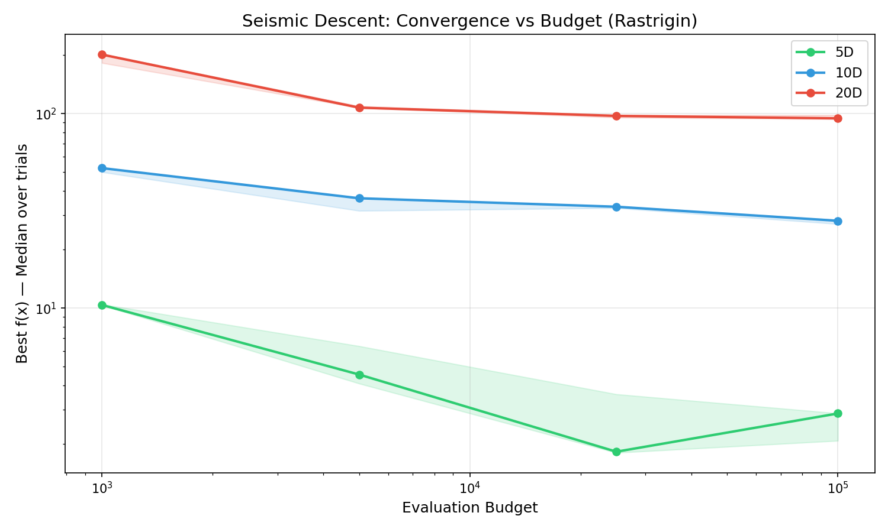

# Estudio Empírico de Convergencia v18

## Curvas de convergencia vs Budget

### 5D
- Budget 1000: Mediana = 10.3900
- Budget 5000: Mediana = 4.5570
- Budget 25000: Mediana = 1.8273
- Budget 100000: Mediana = 2.8736

### 10D
- Budget 1000: Mediana = 52.5302
- Budget 5000: Mediana = 36.7541
- Budget 25000: Mediana = 33.2407
- Budget 100000: Mediana = 28.1505

### 20D
- Budget 1000: Mediana = 201.5607
- Budget 5000: Mediana = 107.4846
- Budget 25000: Mediana = 97.4904
- Budget 100000: Mediana = 94.6916

