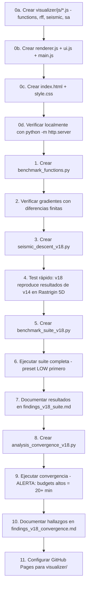

# Plan de Mejora: Seismic Descent v18+

> **Autor:** Claude Opus 4.6 (Thinking) — Abril 2026  
> **Destinatario:** Agente ejecutor con cuota suficiente para implementar  
> **Repo:** `c:\Users\mrcm_\Local\proj\algorithms\seismic-descent`

> [!CAUTION]
> **REGLA DE ORO (GEMINI.md):** Bajo NINGÚN CONCEPTO se debe modificar un archivo `.py` existente. Todas las mejoras se implementan como archivos NUEVOS. Es aceptable duplicar código si esto protege las implementaciones históricas.

---

## Contexto del Algoritmo

**Seismic Descent** optimiza funciones deformando el paisaje objetivo con ruido espacialmente correlacionado en vez de perturbar la partícula directamente:

```
f_total(x, t) = f_original(x) + A(t) · noise(x, t)
```

El **código de referencia estable** es [perlin_opt_nd_grf_analytic_v14_cycles.py](file:///c:/Users/mrcm_/Local/proj/algorithms/seismic-descent/perlin_opt_nd_grf_analytic_v14_cycles.py) (Seismic Swarm + Gradientes Analíticos RFF + 10 ciclos temporales exactos). Todo lo que se construya debe partir de su lógica.

### Resumen de decisiones de diseño ya validadas experimentalmente

| Decisión | Resultado | Doc de referencia |
|---|---|---|
| `noise_decay = 1.0` (sin decay global) | El seno temporal ya hace el scheduling | [findings_v1.md](file:///c:/Users/mrcm_/Local/proj/algorithms/seismic-descent/docs/findings_v1.md) |
| Eliminar `abs()` del seno | Polaridad negativa = embudos gravitacionales | [findings_v8_no_abs.md](file:///c:/Users/mrcm_/Local/proj/algorithms/seismic-descent/docs/findings_v8_no_abs.md) |
| Adam Optimizer | **FRACASO** — RMS neutraliza terremotos | [findings_v11_adam.md](file:///c:/Users/mrcm_/Local/proj/algorithms/seismic-descent/docs/findings_v11_adam.md) |
| Swarm vectorizado con N=D partículas | ~6x speedup, calidad comparable | [findings_v12_swarm.md](file:///c:/Users/mrcm_/Local/proj/algorithms/seismic-descent/docs/findings_v12_swarm.md) |
| `n_cycles = 10` parametrizado | Independencia de budget/partículas | [findings_v14_cycles.md](file:///c:/Users/mrcm_/Local/proj/algorithms/seismic-descent/docs/findings_v14_cycles.md) |
| Bang-Bang reactivo | **FRACASO** — el flujo continuo es indispensable | [findings_v15_reactive.md](file:///c:/Users/mrcm_/Local/proj/algorithms/seismic-descent/docs/findings_v15_reactive.md) |
| Heavy-Ball momentum | **FRACASO** — efecto honda filtra refinamiento | [findings_v16_momentum.md](file:///c:/Users/mrcm_/Local/proj/algorithms/seismic-descent/docs/findings_v16_momentum.md) |
| Octavas temporales fractales | Mejora en 5D, ruido blanco destructivo en 50D | [findings_v17_temporal_octaves.md](file:///c:/Users/mrcm_/Local/proj/algorithms/seismic-descent/docs/findings_v17_temporal_octaves.md) |

---

## Fase 0: Visualizador Interactivo HTML/JS (GitHub Pages)

### Propósito

El visualizador es la **carta de presentación** del algoritmo. La metáfora física de "terremoto al suelo" es tan visual que se vende sola si se anima. Un embed interactivo en la web del repo vale más que 10 tablas de benchmarks.

### Arquitectura: Pure JavaScript + HTML5 Canvas

El visualizador debe ser **100% client-side** (HTML + CSS + JS vanilla) para poder hostearlo directamente en **GitHub Pages** sin servidor. No se necesita framework — Canvas 2D es suficiente para el renderizado del paisaje y las partículas.

> [!IMPORTANT]
> **Deployment:** El directorio `visualizer/` en la raíz del repo será servido por GitHub Pages. Solo necesita un `index.html` y los JS/CSS asociados. Para activar GitHub Pages: Settings → Pages → Source: "Deploy from branch" → branch `main`, folder `/visualizer`.

### Estructura de archivos

```
visualizer/
  index.html           — Punto de entrada, layout y estructura
  css/
    style.css          — Estilos, tema oscuro, layout responsive
  js/
    functions.js       — Funciones objetivo (Rastrigin, Schwefel, etc.) en JS
    rff.js             — Random Fourier Features port a JavaScript
    seismic.js         — Motor del algoritmo Seismic Descent (loop principal)
    sa.js              — Simulated Annealing para comparación lado a lado
    renderer.js        — Renderizado Canvas: heatmap, partículas, trayectorias
    ui.js              — Controles, event listeners, estado de la app
    main.js            — Inicialización y orquestación
```

### Layout del Visualizador

```
┌─────────────────────────────────────────────────────────────────────┐
│  SEISMIC DESCENT — Interactive Visualizer                    [⚙]   │
├───────────────────────────┬──────────────────────────┬──────────────┤
│                           │                          │              │
│   SEISMIC DESCENT         │   SIMULATED ANNEALING    │  CONVERGENCE │
│   [Canvas 400x400]        │   [Canvas 400x400]       │  [Chart]     │
│                           │                          │              │
│   · Heatmap f(x,y)+noise  │   · Heatmap f(x,y)       │  · best_val  │
│   · Partículas + estelas  │   · Partícula + estela   │    vs step   │
│   · Deformación en vivo   │   · Saltos aleatorios    │  · log scale │
│                           │                          │              │
├───────────────────────────┴──────────────────────────┴──────────────┤
│  [▶ Play] [⏸ Pause] [⏭ Step] [⏮ Reset]  Speed: [====●===]        │
│                                                                     │
│  Function: [Rastrigin ▼]   Particles: [10 ▼]   Amplitude: [15.0]    │
│  Show: [✓] Noise field  [✓] Trajectories  [✓] Global optimum       │
├─────────────────────────────────────────────────────────────────────┤
│  Step: 342/2000  │  Best f(x): 0.0432  │  A(t): 12.3  │  Cycle: 3   │
│  [█████████░░░░░░░░░░] 17.1%                                        │
└─────────────────────────────────────────────────────────────────────┘
```

### Componentes Técnicos

#### 1. `functions.js` — Funciones Objetivo en JavaScript

Port directo de `benchmark_functions.py`. Solo se necesita la evaluación escalar (no vectorizada, estamos en 2D):

```javascript
const FUNCTIONS = {
  rastrigin: {
    name: 'Rastrigin',
    fn: (x, y) => 20 + (x*x - 10*Math.cos(2*Math.PI*x)) + (y*y - 10*Math.cos(2*Math.PI*y)),
    grad: (x, y) => [
      2*x + 20*Math.PI*Math.sin(2*Math.PI*x),
      2*y + 20*Math.PI*Math.sin(2*Math.PI*y)
    ],
    range: 5.12,
    globalMin: [0, 0],
    globalMinVal: 0,
  },
  schwefel: {
    name: 'Schwefel',
    fn: (x, y) => 418.9829*2 - x*Math.sin(Math.sqrt(Math.abs(x))) - y*Math.sin(Math.sqrt(Math.abs(y))),
    // ... gradiente análogo
    range: 500,
    globalMin: [420.9687, 420.9687],
    globalMinVal: 0,
  },
  // ... ackley, griewank, rosenbrock, levy, styblinski_tang, michalewicz
};
```

> [!TIP]
> Para el heatmap se pre-computa una textura `ImageData` de la función objetivo estática al cambiar de función. La capa de noise RFF se renderiza como overlay semitransparente que se recalcula cada frame.

#### 2. `rff.js` — Random Fourier Features en JavaScript

Port del RFF de Python. El estado del generador aleatorio debe ser determinista (usar una seed fija para omegas/phis/drifts). Usar un PRNG simple tipo Mulberry32 para reproducir las mismas features que la versión Python:

```javascript
class RFFField {
  constructor(R = 64, nOctaves = 4, seed = 1) {
    this.R = R;
    this.nOctaves = nOctaves;
    const rng = mulberry32(seed);
    
    this.omegas = [];  // [octave][r] = {x, y}
    this.phis = [];    // [octave][r] = float
    this.drifts = [];  // [octave][r] = float
    
    for (let o = 0; o < nOctaves; o++) {
      const lengthscale = 2.0 * Math.pow(2.0, o);
      const octOmegas = [];
      const octPhis = [];
      const octDrifts = [];
      for (let r = 0; r < R; r++) {
        octOmegas.push({
          x: gaussianRandom(rng) / lengthscale,
          y: gaussianRandom(rng) / lengthscale
        });
        octPhis.push(rng() * 2 * Math.PI);
        octDrifts.push(0.1 + rng() * 0.4);
      }
      this.omegas.push(octOmegas);
      this.phis.push(octPhis);
      this.drifts.push(octDrifts);
    }
  }
  
  // Evaluar noise + gradiente en un punto (x, y) en tiempo t
  noiseAndGrad(x, y, t, amplitude) {
    let noiseVal = 0;
    let gradX = 0, gradY = 0;
    let amp = amplitude;
    const sqrt2R = Math.sqrt(2.0 / this.R);
    
    for (let o = 0; o < this.nOctaves; o++) {
      for (let r = 0; r < this.R; r++) {
        const w = this.omegas[o][r];
        const phi = this.phis[o][r];
        const drift = this.drifts[o][r];
        const angle = w.x * x + w.y * y + t * drift + phi;
        noiseVal += amp * sqrt2R * Math.cos(angle);
        // Gradiente: -amp * sqrt2R * sin(angle) * w
        const sinA = Math.sin(angle);
        gradX -= amp * sqrt2R * sinA * w.x;
        gradY -= amp * sqrt2R * sinA * w.y;
      }
      amp *= 0.5;
    }
    return { noise: noiseVal, gradX, gradY };
  }
}
```

#### 3. `renderer.js` — Renderizado del Paisaje

El rendimiento es crítico aquí. Estrategia de renderizado:

1. **Capa base (estática):** Heatmap de `f(x,y)` pre-computado como `ImageData`. Se recalcula solo al cambiar de función. Resolución: ~200×200 pixels mapeados al canvas.
2. **Capa de ruido (dinámica):** Overlay del campo RFF. Se recalcula cada N frames (no cada frame — demasiado caro). La perturbación se visualiza como variación de color/brillo sobre la capa base.
3. **Capa de partículas:** Dibujada con `ctx.arc()` + trail de puntos anteriores con `globalAlpha` decreciente.

```javascript
class Renderer {
  constructor(canvas, fnConfig) {
    this.ctx = canvas.getContext('2d');
    this.width = canvas.width;
    this.height = canvas.height;
    this.fnConfig = fnConfig;
    this.baseImage = null;  // ImageData pre-computada
  }
  
  // Pre-computar heatmap base (llamar una vez por función)
  precomputeBase(resolution = 200) {
    const imageData = this.ctx.createImageData(resolution, resolution);
    const range = this.fnConfig.range;
    // Calcular min/max para normalización de color
    let fMin = Infinity, fMax = -Infinity;
    const values = new Float64Array(resolution * resolution);
    
    for (let py = 0; py < resolution; py++) {
      for (let px = 0; px < resolution; px++) {
        const x = (px / resolution) * 2 * range - range;
        const y = (py / resolution) * 2 * range - range;
        const val = this.fnConfig.fn(x, y);
        values[py * resolution + px] = val;
        fMin = Math.min(fMin, val);
        fMax = Math.max(fMax, val);
      }
    }
    
    // Mapear valores a paleta de color (viridis-like)
    for (let i = 0; i < values.length; i++) {
      const t = (values[i] - fMin) / (fMax - fMin);
      const [r, g, b] = viridisColor(t);
      imageData.data[i * 4]     = r;
      imageData.data[i * 4 + 1] = g;
      imageData.data[i * 4 + 2] = b;
      imageData.data[i * 4 + 3] = 255;
    }
    this.baseImage = imageData;
  }
  
  // Renderizar frame completo
  renderFrame(particles, trails, rffField, t, amplitude, showNoise) {
    // 1. Dibujar base
    this.ctx.putImageData(this.baseImage, 0, 0);
    // Escalar al tamaño del canvas
    // (usar un canvas offscreen para la base y drawImage para escalar)
    
    // 2. Overlay de ruido si showNoise
    if (showNoise && Math.abs(amplitude) > 0.01) {
      this.renderNoiseOverlay(rffField, t, amplitude);
    }
    
    // 3. Dibujar trails
    this.renderTrails(trails);
    
    // 4. Dibujar partículas
    this.renderParticles(particles);
    
    // 5. Marcar óptimo global
    this.renderGlobalOptimum();
  }
}
```

> [!WARNING]
> **Rendimiento del overlay RFF:** Evaluar `rffField.noiseAndGrad()` en cada pixel del canvas cada frame es prohibitivo (~200×200×64×4 = 10M operaciones). Soluciones:
> 1. **Resolución baja para noise:** Evaluar el RFF en una grid 50×50 y escalar con interpolación bilinear.
> 2. **Skip frames:** Solo recalcular el overlay cada 3-5 frames de animación.
> 3. **Web Workers:** Mover el cálculo del overlay a un worker si el main thread sufre.
>
> La opción 1 + 2 combinadas deberían ser suficientes para 60fps.

#### 4. `seismic.js` — Motor del Algoritmo

Port del loop principal de `seismic_swarm_rff_analytic()` de v14. La diferencia clave es que aquí el loop no corre de golpe sino **paso a paso**, controlado por la UI:

```javascript
class SeismicEngine {
  constructor(fnConfig, rffField, options = {}) {
    this.fn = fnConfig.fn;
    this.grad = fnConfig.grad;
    this.rff = rffField;
    this.range = fnConfig.range;
    
    this.nParticles = options.nParticles || 10;
    this.dt = options.dt || 0.01;
    this.noiseAmplitude = options.noiseAmplitude || 15.0;
    this.nCycles = options.nCycles || 10;
    this.nSteps = options.nSteps || 2000;
    
    this.reset();
  }
  
  reset() {
    this.step = 0;
    this.t = 0;
    this.dtNoise = (this.nCycles * Math.PI) / this.nSteps;
    
    // Inicializar partículas aleatorias en [-range, range]^2
    this.particles = [];
    for (let i = 0; i < this.nParticles; i++) {
      this.particles.push({
        x: Math.random() * 2 * this.range - this.range,
        y: Math.random() * 2 * this.range - this.range,
      });
    }
    
    // Tracking del mejor
    this.bestVal = Infinity;
    this.bestPos = { x: 0, y: 0 };
    this.bestHistory = [];
    this.trails = this.particles.map(() => []);  // trail por partícula
    
    this._updateBest();
  }
  
  // Ejecutar UN paso del algoritmo
  tick() {
    if (this.step >= this.nSteps) return false;
    
    const freq = 2.0;  // noise_decay = 1.0
    const amp = this.noiseAmplitude * Math.sin(this.t * freq);
    
    for (let i = 0; i < this.nParticles; i++) {
      const p = this.particles[i];
      
      // Gradiente de la función objetivo
      const [fgx, fgy] = this.grad(p.x, p.y);
      
      // Gradiente del campo RFF
      const rffResult = this.rff.noiseAndGrad(p.x, p.y, this.t, amp);
      
      // Descenso por gradiente combinado
      p.x -= this.dt * (fgx + rffResult.gradX);
      p.y -= this.dt * (fgy + rffResult.gradY);
      
      // Clip al dominio
      p.x = Math.max(-this.range, Math.min(this.range, p.x));
      p.y = Math.max(-this.range, Math.min(this.range, p.y));
      
      // Guardar trail
      this.trails[i].push({ x: p.x, y: p.y });
    }
    
    this.t += this.dtNoise;
    this.step++;
    this._updateBest();
    return true;
  }
  
  _updateBest() {
    for (const p of this.particles) {
      const val = this.fn(p.x, p.y);
      if (val < this.bestVal) {
        this.bestVal = val;
        this.bestPos = { x: p.x, y: p.y };
      }
    }
    this.bestHistory.push(this.bestVal);
  }
  
  // Propiedades para la UI
  get currentAmplitude() {
    return this.noiseAmplitude * Math.sin(this.t * 2.0);
  }
  
  get currentCycle() {
    return Math.floor(this.t / Math.PI);
  }
  
  get progress() {
    return this.step / this.nSteps;
  }
}
```

#### 5. `sa.js` — Simulated Annealing (para comparación)

Implementación mínima de SA en JS para el panel derecho:

```javascript
class SAEngine {
  constructor(fnConfig, options = {}) {
    this.fn = fnConfig.fn;
    this.range = fnConfig.range;
    this.nSteps = options.nSteps || 2000;
    this.T0 = options.T0 || 10.0;
    this.cooling = options.cooling || 0.999;
    this.stepSize = options.stepSize || 0.3;
    this.reset();
  }
  
  reset() {
    this.step = 0;
    this.T = this.T0;
    this.pos = {
      x: Math.random() * 2 * this.range - this.range,
      y: Math.random() * 2 * this.range - this.range,
    };
    this.currentVal = this.fn(this.pos.x, this.pos.y);
    this.bestVal = this.currentVal;
    this.bestPos = { ...this.pos };
    this.bestHistory = [this.bestVal];
    this.trail = [{ ...this.pos }];
  }
  
  tick() {
    if (this.step >= this.nSteps) return false;
    
    const nx = Math.max(-this.range, Math.min(this.range,
      this.pos.x + gaussianRandom() * this.stepSize));
    const ny = Math.max(-this.range, Math.min(this.range,
      this.pos.y + gaussianRandom() * this.stepSize));
    const newVal = this.fn(nx, ny);
    const delta = newVal - this.currentVal;
    
    if (delta < 0 || Math.random() < Math.exp(-delta / Math.max(this.T, 1e-10))) {
      this.pos = { x: nx, y: ny };
      this.currentVal = newVal;
    }
    if (this.currentVal < this.bestVal) {
      this.bestVal = this.currentVal;
      this.bestPos = { ...this.pos };
    }
    
    this.T *= this.cooling;
    this.step++;
    this.trail.push({ ...this.pos });
    this.bestHistory.push(this.bestVal);
    return true;
  }
}
```

### Diseño Visual

**Tema:** Dark mode obligatorio. El visualizador debe sentirse premium y científico.

**Paleta sugerida:**
- Fondo: `#0a0a1a` (casi negro azulado)
- Paneles: `#12122a` con borde `#2a2a4a`
- Accent: `#00ff88` (verde sísmic) para partículas del Seismic Descent
- SA accent: `#ff6b6b` (rojo suave) para la partícula de SA
- Texto: `#e0e0f0`
- Heatmap: paleta Viridis (consistente con los plots matplotlib existentes)

**Tipografía:** Google Fonts `Inter` para UI, `JetBrains Mono` para números/datos.

**Micro-animaciones:**
- Partículas con glow pulsante proporcional a `|A(t)|` — cuando el sismo es fuerte, brillan más.
- Trails con fade-out gradual (últimos 100 puntos visibles, alpha decreciente).
- Transición suave del overlay de noise con interpolación entre frames.
- Barra de progreso con gradiente animado.

### Interacciones del Usuario

| Control | Comportamiento |
|---|---|
| **▶ Play** | Loop de animación con `requestAnimationFrame`. Ejecuta N ticks por frame según slider de velocidad. |
| **⏸ Pause** | Congela el estado actual. La UI sigue respondiendo. |
| **⏭ Step** | Ejecuta exactamente 1 tick. Útil para inspección detallada. |
| **⏮ Reset** | Reinicializa partículas con nueva seed. Limpia trails y charts. |
| **Speed slider** | Controla cuántos `tick()` se ejecutan por frame de animación (1 a 50). |
| **Function dropdown** | Cambia la función objetivo. Recalcula el heatmap base. Reset automático. |
| **Particles input** | Número de partículas Seismic (2-50). Reset necesario. |
| **Amplitude input** | `noise_amplitude`. Cambio en vivo sin reset. |
| **Checkboxes** | Toggles visuales: noise overlay, trayectorias, óptimo global. |

### Chart de Convergencia

Usar **Canvas básico** para la gráfica de convergencia (no depender de Chart.js para mantener zero-dependency). Dibujar:
- Eje Y log-scale: `best_val` del Seismic (verde) y SA (rojo)
- Eje X lineal: step number
- Update en vivo cada frame

### Responsive

Para pantallas pequeñas (<900px), apilar los canvas verticalmente en vez de lado a lado. El chart de convergencia pasa debajo.

### Verificación del Visualizador

- [ ] `index.html` abre correctamente servido con `python -m http.server` desde `visualizer/`
- [ ] El heatmap de Rastrigin 2D coincide visualmente con el plot de `perlin_opt.py`
- [ ] Las partículas se mueven coherentemente (no saltan erráticamente ni se salen del dominio)
- [ ] El campo RFF se deforma visualmente cuando `A(t) > 0` y se invierte cuando `A(t) < 0`
- [ ] La curva de convergencia del Seismic desciende monótonamente
- [ ] La comparación visual Seismic vs SA es claramente distinta (barrido orgánico vs saltos)
- [ ] Cambiar de función recalcula el heatmap y resetea correctamente
- [ ] El visualizador funciona en GitHub Pages al hacer push del directorio `visualizer/`

> [!NOTE]
> **Sobre el PRNG en JavaScript:** Python usa `np.random.default_rng(seed=1)` para generar los omegas/phis/drifts del RFF. Para que el visualizador JS replique exactamente el mismo campo de ruido que la versión Python, se necesitaría implementar el mismo PRNG (PCG64). **Esto NO es necesario** — basta con que el comportamiento cualitativo sea idéntico (correlación espacial, octavas, amplitud). Usar cualquier PRNG seedable simple (Mulberry32) con una seed fija diferente está perfectamente bien.

---

## Fase 1: Generalización — Desacoplar Función Objetivo del Optimizador

### Problema actual

Rastrigin y su gradiente analítico están **hardcodeados** dentro de `seismic_swarm_rff_analytic()`. Para evaluar otras funciones hay que duplicar todo el archivo y editar las líneas de la función. Esto frena la iteración científica.

### Objetivo

Crear un archivo **nuevo** con el optimizador genérico que acepte cualquier función objetivo y su gradiente como parámetros.

### Archivo a crear

#### [NEW] `seismic_descent_v18.py`

```python
"""
seismic_descent_v18.py — Seismic Swarm Genérico (Function-Agnostic)

Basado en v14_cycles. No modifica ningún archivo existente.
Desacopla la función objetivo del optimizador para validación multi-función.
"""

import numpy as np

# ------------------------------------------------------------------ #
# Random Fourier Features — Vectorizado (copiado de v14 sin cambios)
# ------------------------------------------------------------------ #

_R = 64
_rng = np.random.default_rng(seed=1)

_N_OCTAVES = 4
_OMEGAS = []
_PHIS   = _rng.uniform(0, 2 * np.pi, size=(_N_OCTAVES, _R))
_DRIFTS = _rng.uniform(0.1, 0.5,     size=(_N_OCTAVES, _R))

_D_MAX = 100
for o in range(_N_OCTAVES):
    lengthscale = 2.0 * (2.0 ** o)
    omegas = _rng.normal(0, 1.0 / lengthscale, size=(_R, _D_MAX))
    _OMEGAS.append(omegas)


def rff_noise_grad_vec(X, t, amplitude=15.0, octaves=4):
    """Gradiente RFF vectorizado para N partículas. Shape X: (N, D)."""
    if X.ndim == 1:
        X = X.reshape(1, -1)
    N, D = X.shape
    grad = np.zeros((N, D))
    amp = amplitude
    sqrt_2_R = np.sqrt(2.0 / _R)

    for o in range(octaves):
        omegas = _OMEGAS[o][:, :D]
        phis   = _PHIS[o][:, None]
        drifts = _DRIFTS[o][:, None]
        projections = omegas @ X.T
        angles = projections + t * drifts + phis
        sines = np.sin(angles)
        grad_contrib = (omegas.T @ sines).T
        grad -= amp * sqrt_2_R * grad_contrib
        amp *= 0.5

    return grad


# ------------------------------------------------------------------ #
# Seismic Swarm — Genérico
# ------------------------------------------------------------------ #

def seismic_swarm(
    fn,                    # callable(X) -> array(N,) — función objetivo vectorizada
    fn_grad,               # callable(X) -> array(N, D) — gradiente analítico vectorizado
    x0,                    # array(D,) — punto inicial
    n_steps=2000,
    n_particles=10,
    dt=0.01,
    noise_amplitude=15.0,
    noise_decay=1.0,
    search_range=5.12,
    n_cycles=10,
):
    """
    Seismic Swarm genérico con RFF y gradiente analítico.
    
    Parámetros
    ----------
    fn : callable
        Función objetivo. Debe aceptar X de shape (N, D) y devolver array (N,).
        También debe aceptar X de shape (D,) y devolver un escalar.
    fn_grad : callable
        Gradiente analítico de fn. Misma convención de shapes.
    x0 : array_like de shape (D,)
        Punto de inicio para la primera partícula del enjambre.
    n_steps : int
        Número de pasos de optimización.
    n_particles : int
        Número de partículas en el enjambre.
    dt : float
        Paso de gradiente descendente.
    noise_amplitude : float
        Amplitud base del campo RFF.
    noise_decay : float
        Factor de decay exponencial. Usar 1.0 para sin decay (recomendado).
    search_range : float
        El dominio es [-search_range, search_range]^D.
    n_cycles : int
        Número exacto de ciclos sísmicos completos a ejecutar.
    
    Retorna
    -------
    best_x : array(D,)
    best_val : float
    history : dict con 'best_per_step' (array de n_steps+1 floats)
    """
    D = len(x0)
    
    X = np.random.uniform(-search_range, search_range, size=(n_particles, D))
    X[0] = np.array(x0, dtype=float)
    
    t = 0.0
    dt_noise = (n_cycles * np.pi) / n_steps

    real_vals = fn(X)
    best_idx = np.argmin(real_vals)
    best_val = real_vals[best_idx]
    best_x = X[best_idx].copy()
    
    best_per_step = [float(best_val)]

    for step in range(n_steps):
        decay = noise_decay ** step
        freq  = 2.0 * decay
        amp   = noise_amplitude * decay * np.sin(t * freq)

        f_grad = fn_grad(X)
        noise_grad = rff_noise_grad_vec(X, t, amp)
        
        grad = f_grad + noise_grad
        X -= dt * grad
        np.clip(X, -search_range, search_range, out=X)
        t += dt_noise

        real_vals = fn(X)
        step_best_idx = np.argmin(real_vals)
        if real_vals[step_best_idx] < best_val:
            best_val = real_vals[step_best_idx]
            best_x = X[step_best_idx].copy()
        
        best_per_step.append(float(best_val))

    return best_x, best_val, {'best_per_step': best_per_step}
```

> [!IMPORTANT]
> **Diferencias clave respecto a v14:**
> 1. `fn` y `fn_grad` son **parámetros**, no hardcodeados.
> 2. Retorna un `history dict` con la curva de convergencia `best_per_step` — imprescindible para análisis de convergencia (Fase 3).
> 3. Todo lo demás (RFF, ciclos, sin abs, sin decay) es idéntico a v14.

---

#### [NEW] `benchmark_functions.py` — Registro de Funciones de Test

Este archivo centraliza TODAS las funciones de benchmark con su evaluación vectorizada y gradiente analítico.

```python
"""
benchmark_functions.py — Registro de funciones de optimización benchmark.

Cada función expone:
  - fn(X) : evaluación vectorizada, X shape (N, D) -> (N,) o (D,) -> escalar
  - grad(X) : gradiente analítico vectorizado, mismas shapes
  - info : dict con 'name', 'search_range', 'global_min', 'global_min_val'
"""

import numpy as np

# ================================================================== #
# RASTRIGIN
# ================================================================== #

def rastrigin(X):
    if X.ndim == 1:
        return 10.0 * len(X) + np.sum(X**2 - 10.0 * np.cos(2.0 * np.pi * X))
    D = X.shape[1]
    return 10.0 * D + np.sum(X**2 - 10.0 * np.cos(2.0 * np.pi * X), axis=1)

def rastrigin_grad(X):
    return 2.0 * X + 20.0 * np.pi * np.sin(2.0 * np.pi * X)

RASTRIGIN = {
    'fn': rastrigin,
    'grad': rastrigin_grad,
    'name': 'Rastrigin',
    'search_range': 5.12,
    'global_min': 0.0,    # x* = (0, 0, ..., 0)
    'global_min_val': 0.0,
}


# ================================================================== #
# SCHWEFEL
# ================================================================== #

def schwefel(X):
    if X.ndim == 1:
        D = len(X)
        return 418.9829 * D - np.sum(X * np.sin(np.sqrt(np.abs(X))))
    D = X.shape[1]
    return 418.9829 * D - np.sum(X * np.sin(np.sqrt(np.abs(X))), axis=1)

def schwefel_grad(X):
    """
    Gradiente de Schwefel: d/dx_i [ -x_i * sin(sqrt(|x_i|)) ]
    
    Para x_i > 0:
        = -sin(sqrt(x_i)) - x_i * cos(sqrt(x_i)) * 1/(2*sqrt(x_i))
        = -sin(sqrt(x_i)) - sqrt(x_i)/2 * cos(sqrt(x_i))
    Para x_i < 0:
        = -sin(sqrt(-x_i)) + sqrt(-x_i)/2 * cos(sqrt(-x_i))
    
    Nota: No diferenciable en x_i = 0, usamos subgradiente = 0.
    """
    abs_X = np.abs(X)
    sqrt_abs = np.sqrt(abs_X + 1e-30)  # evitar div/0
    sin_term = np.sin(sqrt_abs)
    cos_term = np.cos(sqrt_abs)
    
    grad = -sin_term - (X / (2.0 * sqrt_abs + 1e-30)) * cos_term
    return grad

SCHWEFEL = {
    'fn': schwefel,
    'grad': schwefel_grad,
    'name': 'Schwefel',
    'search_range': 500.0,
    'global_min': 420.9687,     # x* ≈ (420.9687, ..., 420.9687)
    'global_min_val': 0.0,
}


# ================================================================== #
# ACKLEY
# ================================================================== #

def ackley(X):
    a, b, c = 20.0, 0.2, 2.0 * np.pi
    if X.ndim == 1:
        D = len(X)
        sum1 = np.sum(X**2)
        sum2 = np.sum(np.cos(c * X))
        return -a * np.exp(-b * np.sqrt(sum1 / D)) - np.exp(sum2 / D) + a + np.e
    D = X.shape[1]
    sum1 = np.sum(X**2, axis=1)
    sum2 = np.sum(np.cos(c * X), axis=1)
    return -a * np.exp(-b * np.sqrt(sum1 / D)) - np.exp(sum2 / D) + a + np.e

def ackley_grad(X):
    """
    Gradiente de Ackley respecto a x_i.
    """
    a, b, c = 20.0, 0.2, 2.0 * np.pi
    if X.ndim == 1:
        X = X.reshape(1, -1)
    D = X.shape[1]
    
    sum_sq = np.sum(X**2, axis=1, keepdims=True)  # (N, 1)
    sqrt_term = np.sqrt(sum_sq / D + 1e-30)       # (N, 1)
    
    # Término 1: d/dx_i [-a * exp(-b * sqrt(sum_sq/D))]
    exp1 = np.exp(-b * sqrt_term)                  # (N, 1)
    term1 = a * b * exp1 * X / (D * sqrt_term)     # (N, D)
    
    # Término 2: d/dx_i [-exp(sum_cos/D)]
    sum_cos = np.sum(np.cos(c * X), axis=1, keepdims=True)  # (N, 1)
    exp2 = np.exp(sum_cos / D)                                # (N, 1)
    term2 = exp2 * c * np.sin(c * X) / D                      # (N, D)
    
    return term1 + term2

ACKLEY = {
    'fn': ackley,
    'grad': ackley_grad,
    'name': 'Ackley',
    'search_range': 32.768,
    'global_min': 0.0,
    'global_min_val': 0.0,
}


# ================================================================== #
# GRIEWANK
# ================================================================== #

def griewank(X):
    if X.ndim == 1:
        D = len(X)
        sum_term = np.sum(X**2) / 4000.0
        indices = np.arange(1, D + 1)
        prod_term = np.prod(np.cos(X / np.sqrt(indices)))
        return sum_term - prod_term + 1.0
    D = X.shape[1]
    sum_term = np.sum(X**2, axis=1) / 4000.0
    indices = np.arange(1, D + 1)
    prod_term = np.prod(np.cos(X / np.sqrt(indices)), axis=1)
    return sum_term - prod_term + 1.0

def griewank_grad(X):
    """
    d/dx_i = x_i/2000 + prod_{j!=i}[cos(x_j/sqrt(j))] * sin(x_i/sqrt(i)) / sqrt(i)
    """
    if X.ndim == 1:
        X = X.reshape(1, -1)
    N, D = X.shape
    indices = np.arange(1, D + 1)                    # (D,)
    sqrt_idx = np.sqrt(indices)                        # (D,)
    
    cos_terms = np.cos(X / sqrt_idx)                   # (N, D)
    full_prod = np.prod(cos_terms, axis=1, keepdims=True)  # (N, 1)
    
    # prod_{j!=i} cos(x_j/sqrt(j)) = full_prod / cos(x_i/sqrt(i))
    safe_cos = np.where(np.abs(cos_terms) < 1e-15, 1e-15, cos_terms)
    prod_without_i = full_prod / safe_cos              # (N, D)
    
    sin_terms = np.sin(X / sqrt_idx)                   # (N, D)
    
    grad = X / 2000.0 + prod_without_i * sin_terms / sqrt_idx
    return grad

GRIEWANK = {
    'fn': griewank,
    'grad': griewank_grad,
    'name': 'Griewank',
    'search_range': 600.0,
    'global_min': 0.0,
    'global_min_val': 0.0,
}


# ================================================================== #
# ROSENBROCK
# ================================================================== #

def rosenbrock(X):
    if X.ndim == 1:
        return np.sum(100.0 * (X[1:] - X[:-1]**2)**2 + (1 - X[:-1])**2)
    return np.sum(100.0 * (X[:, 1:] - X[:, :-1]**2)**2 + (1 - X[:, :-1])**2, axis=1)

def rosenbrock_grad(X):
    """
    Gradiente de Rosenbrock:
      d/dx_i = -400*x_i*(x_{i+1} - x_i^2) - 2*(1-x_i)  [para i < D-1]
             + 200*(x_i - x_{i-1}^2)                      [para i > 0]
    """
    if X.ndim == 1:
        X = X.reshape(1, -1)
    N, D = X.shape
    grad = np.zeros_like(X)
    
    # Contribución como "variable izquierda" (i < D-1)
    grad[:, :-1] += -400.0 * X[:, :-1] * (X[:, 1:] - X[:, :-1]**2) - 2.0 * (1 - X[:, :-1])
    # Contribución como "variable derecha" (i > 0)
    grad[:, 1:]  += 200.0 * (X[:, 1:] - X[:, :-1]**2)
    
    return grad

ROSENBROCK = {
    'fn': rosenbrock,
    'grad': rosenbrock_grad,
    'name': 'Rosenbrock',
    'search_range': 5.0,
    'global_min': 1.0,        # x* = (1, 1, ..., 1)
    'global_min_val': 0.0,
}


# ================================================================== #
# Registro completo
# ================================================================== #

ALL_FUNCTIONS = {
    'rastrigin': RASTRIGIN,
    'schwefel': SCHWEFEL,
    'ackley': ACKLEY,
    'griewank': GRIEWANK,
    'rosenbrock': ROSENBROCK,
}
```

> [!WARNING]
> **Gradientes críticos a verificar manualmente:**
> - `schwefel_grad`: el `|x|` dentro de la raíz introduce un punto no-diferenciable en 0. La implementación usa `1e-30` como epsilon. Validar con diferencias finitas antes de confiar.
> - `ackley_grad`: cuando `sum_sq ≈ 0`, el `sqrt_term` tiende a 0 y el gradiente explota. El epsilon `1e-30` debería bastar, pero verificar con `X ≈ 0`.
> - `griewank_grad`: la división `full_prod / cos(x_i/sqrt(i))` es inestable cuando `cos ≈ 0`. Se clampea a `1e-15`.
>
> **Procedimiento de verificación:** Para cada función, generar 100 puntos aleatorios y comparar `grad(X)` contra diferencias finitas `(fn(X + eps*e_i) - fn(X)) / eps` con `eps=1e-7`. El error relativo debe ser < `1e-4` en más del 99% de los puntos.

---

## Fase 2: Benchmark Suite Ampliada

### Objetivo

Ejecutar Seismic Swarm contra SA y CMA-ES en las 5 funciones del registro, en dimensiones `{5, 10, 20, 50}`, con presupuesto controlado. Generar un informe estructurado con tablas comparativas.

### Archivo a crear

#### [NEW] `benchmark_suite_v18.py`

Estructura del benchmark:

```python
"""
benchmark_suite_v18.py — Suite de benchmark multi-función para Seismic Descent.

Evalúa Seismic Swarm (v18) contra SA y CMA-ES en todas las funciones
del registro benchmark_functions.py.

USO:
    python benchmark_suite_v18.py                          # todas las funciones, preset low
    python benchmark_suite_v18.py --functions rastrigin schwefel  # solo esas
    python benchmark_suite_v18.py --preset high            # presupuesto alto
    python benchmark_suite_v18.py --dims 5,10              # solo esas dimensiones
"""

import argparse
import time
import json
import numpy as np
import cma

from seismic_descent_v18 import seismic_swarm
from benchmark_functions import ALL_FUNCTIONS


def cmaes_run(fn, x0, eval_budget, search_range):
    """Wrapper genérico de CMA-ES."""
    opts = cma.CMAOptions()
    opts['bounds'] = [[-search_range] * len(x0), [search_range] * len(x0)]
    opts['maxfevals'] = eval_budget
    opts['verbose'] = -9
    # sigma0 proporcional al rango de búsqueda
    sigma0 = search_range * 0.8
    es = cma.CMAEvolutionStrategy(list(x0), sigma0, opts)
    while not es.stop():
        solutions = es.ask()
        es.tell(solutions, [float(fn(np.array(s))) for s in solutions])
    return es.result.xbest, es.result.fbest


def sa_generic(fn, x0, n_steps=5000, T0=10.0, cooling=0.999,
               step_size=0.3, search_range=5.12):
    """Simulated Annealing genérico (no hardcodeado a Rastrigin)."""
    x = np.array(x0, dtype=float)
    current_val = float(fn(x))
    best_x = x.copy()
    best_val = current_val
    T = T0

    for _ in range(n_steps):
        x_new = np.clip(
            x + np.random.normal(0, step_size, size=len(x)),
            -search_range, search_range
        )
        new_val = float(fn(x_new))
        delta = new_val - current_val
        if delta < 0 or np.random.random() < np.exp(-delta / max(T, 1e-10)):
            x, current_val = x_new, new_val
        if current_val < best_val:
            best_val = current_val
            best_x = x.copy()
        T *= cooling

    return best_x, best_val


def run_single_benchmark(func_config, dims, n_trials, eval_budget_base):
    """Ejecuta benchmark para 1 función x 1 dimensión."""
    fn = func_config['fn']
    fn_grad = func_config['grad']
    search_range = func_config['search_range']
    fname = func_config['name']
    
    eval_budget = eval_budget_base * (dims + 1)
    n_particles = max(dims, 5)  # mínimo 5 partículas
    seismic_steps = eval_budget // n_particles
    sa_steps = eval_budget
    
    # Threshold: usar un porcentaje del valor típico aleatorio
    threshold = dims * 1.0  # heurístico, se puede refinar

    results = {'seismic': [], 'sa': [], 'cmaes': []}
    times = {'seismic': 0.0, 'sa': 0.0, 'cmaes': 0.0}

    np.random.seed(42)

    for trial in range(n_trials):
        x0 = np.random.uniform(-search_range, search_range, size=dims)

        # --- Seismic ---
        t0 = time.time()
        _, sval, _ = seismic_swarm(
            fn, fn_grad, x0,
            n_steps=seismic_steps,
            n_particles=n_particles,
            search_range=search_range,
        )
        times['seismic'] += time.time() - t0
        results['seismic'].append(float(sval))

        # --- SA ---
        t0 = time.time()
        _, sa_val = sa_generic(fn, x0, n_steps=sa_steps, search_range=search_range)
        times['sa'] += time.time() - t0
        results['sa'].append(float(sa_val))

        # --- CMA-ES ---
        t0 = time.time()
        _, cma_val = cmaes_run(fn, x0, eval_budget, search_range)
        times['cmaes'] += time.time() - t0
        results['cmaes'].append(float(cma_val))

    return {
        'function': fname,
        'dims': dims,
        'n_trials': n_trials,
        'eval_budget': eval_budget,
        'results': {
            algo: {
                'values': vals,
                'mean': float(np.mean(vals)),
                'median': float(np.median(vals)),
                'std': float(np.std(vals)),
                'successes': int(sum(1 for v in vals if v < threshold)),
                'time_s': float(times[algo]),
            }
            for algo, vals in results.items()
        },
        'threshold': threshold,
    }
```

> [!IMPORTANT]
> **SA genérico:** La implementación de SA en `perlin_opt_nd.py` llama internamente a `rastrigin_nd()`. Como NO podemos modificar ese archivo, el benchmark suite debe incluir su propia implementación de SA genérico (`sa_generic`). Es duplicación aceptable bajo la regla de oro.

### Parámetros de benchmark por función

Cada función tiene peculiaridades que requieren ajustes en los hiperparámetros del Seismic Swarm:

| Función | `search_range` | `noise_amplitude` recomendada | Notas |
|---|---|---|---|
| Rastrigin | 5.12 | 15.0 (default) | Barreras de ~10. Amplitud 15 las supera. |
| Schwefel | 500.0 | 1500.0 | Barreras proporcionales al rango x D. Escalar `noise_amplitude ≈ 3 x search_range`. |
| Ackley | 32.768 | 15.0 | El gradiente nabla f ≈ 0 en la meseta. SD probablemente fracasará aquí — documentar honestamente. |
| Griewank | 600.0 | 5.0 | Barreras son muy pequeñas (~1.0). Sobrecargar el noise destruye la señal. |
| Rosenbrock | 5.0 | 10.0 | Valle estrecho curvo. El noise ayuda a explorar lateralmente pero puede sacar del valle. |

> [!TIP]
> **Ajuste de `noise_amplitude` proporcional a las barreras:** Una buena heurística de partida es `noise_amplitude ≈ barrier_height x 1.5`. Para Rastrigin, la barrera entre mínimos locales es ~10, por eso 15 funciona. Calcular un valor similar para cada función mirando la diferencia típica entre mínimo local y silla de montar.

### Formato de salida

El benchmark debe generar:

1. **Salida en consola** con tablas legibles (estilo actual de `benchmark_budgets.py`).
2. **Archivo JSON** con todos los resultados numéricos para análisis posterior (guardar en `results/benchmark_suite_v18.json`).
3. **Archivo Markdown** con tablas comparativas (guardar en `docs/findings_v18_suite.md`).

Ejemplo de tabla de salida esperada en el markdown:

```markdown
## Rastrigin 5D — 30 trials | budget=3000 evals

| Algoritmo | Éxitos (f<5.0) | Media | Mediana | Std | Tiempo |
|---|---|---|---|---|---|
| Seismic Swarm | 27/30 | 3.21 | 2.45 | 2.8 | 1.2s |
| SA | 12/30 | 8.92 | 7.34 | 5.1 | 0.8s |
| CMA-ES | 18/30 | 5.67 | 4.01 | 4.2 | 2.1s |
```

---

## Fase 3: Análisis de Convergencia Empírica

### Objetivo

Estudiar si Seismic Descent converge al óptimo global dado presupuesto infinito, y determinar el techo dimensional D* por encima del cual deja de ser competitivo.

### Experimento 3.1: Curvas de Convergencia

**Qué hacer:** Para Rastrigin {5D, 10D, 20D}, ejecutar Seismic Swarm con presupuestos crecientes: `{1K, 5K, 25K, 100K, 500K}` evaluaciones. Graficar la mediana de `best_val` en función del budget.

#### [NEW] `analysis_convergence_v18.py`

```python
"""
analysis_convergence_v18.py — Estudio empírico de convergencia de Seismic Descent.

Genera:
  1. Curvas de convergencia budget -> best_val para múltiples dimensiones
  2. Análisis del techo dimensional D* 
  3. Gráficas PNG guardadas en results/
"""

import numpy as np
import matplotlib
matplotlib.use('Agg')
import matplotlib.pyplot as plt
from seismic_descent_v18 import seismic_swarm
from benchmark_functions import RASTRIGIN

def convergence_vs_budget(dims_list, budgets, n_trials=20):
    """
    Para cada dimensión y budget, ejecutar n_trials y recoger mediana de best_val.
    """
    results = {}  # {dims: {budget: median_val}}
    
    for dims in dims_list:
        results[dims] = {}
        fn_config = RASTRIGIN
        fn, fn_grad = fn_config['fn'], fn_config['grad']
        search_range = fn_config['search_range']
        
        for budget in budgets:
            n_particles = max(dims, 5)
            n_steps = budget // n_particles
            
            vals = []
            for trial in range(n_trials):
                np.random.seed(trial * 1000 + dims)
                x0 = np.random.uniform(-search_range, search_range, size=dims)
                _, bval, _ = seismic_swarm(
                    fn, fn_grad, x0,
                    n_steps=n_steps, n_particles=n_particles,
                    search_range=search_range,
                )
                vals.append(bval)
            
            results[dims][budget] = {
                'median': float(np.median(vals)),
                'mean': float(np.mean(vals)),
                'q25': float(np.percentile(vals, 25)),
                'q75': float(np.percentile(vals, 75)),
            }
            print(f"  {dims}D, budget={budget}: median={results[dims][budget]['median']:.4f}")
    
    return results


def plot_convergence(results, budgets, filename='results/convergence_curves.png'):
    """Graficar curvas de convergencia."""
    fig, ax = plt.subplots(figsize=(10, 6))
    
    colors = {5: '#2ecc71', 10: '#3498db', 20: '#e74c3c', 50: '#9b59b6'}
    
    for dims, budget_results in results.items():
        medians = [budget_results[b]['median'] for b in budgets]
        q25s = [budget_results[b]['q25'] for b in budgets]
        q75s = [budget_results[b]['q75'] for b in budgets]
        
        color = colors.get(dims, '#333')
        ax.plot(budgets, medians, 'o-', color=color, label=f'{dims}D', linewidth=2)
        ax.fill_between(budgets, q25s, q75s, alpha=0.15, color=color)
    
    ax.set_xscale('log')
    ax.set_yscale('log')
    ax.set_xlabel('Evaluation Budget', fontsize=12)
    ax.set_ylabel('Best f(x) — Median over trials', fontsize=12)
    ax.set_title('Seismic Descent: Convergence vs Budget (Rastrigin)', fontsize=14)
    ax.legend(fontsize=11)
    ax.grid(True, alpha=0.3)
    plt.tight_layout()
    plt.savefig(filename, dpi=150)
    print(f"Guardado: {filename}")


if __name__ == '__main__':
    dims_list = [5, 10, 20, 50]
    budgets = [1000, 5000, 25000, 100000, 500000]
    
    print("=== Convergencia vs Budget ===")
    results = convergence_vs_budget(dims_list, budgets, n_trials=20)
    plot_convergence(results, budgets)
```

### Experimento 3.2: Techo Dimensional D*

**Hipótesis a validar:** Existe un D* tal que para D <= D*, Seismic Descent con presupuesto suficiente converge al óptimo global con probabilidad tendiente a 1, y para D > D* se estanca en un plateau logarítmico.

**Qué hacer:**
1. Fijar un budget alto (100K evals).
2. Barrer dimensiones: `{2, 3, 5, 7, 10, 15, 20, 30, 50}`.
3. Ejecutar 30 trials por dimensión.
4. Medir la **tasa de éxito** (fracción con `f < threshold`), donde `threshold = 1.0` (cercano al óptimo global).
5. Graficar tasa de éxito vs dimensión — la curva debería mostrar una transición de fase nítida.

**Predicción basada en los datos existentes:** Los datos de `findings_budgets_scale.md` muestran 100% éxito en 5D con budget alto, pero fuerte degradación en 10D+. Mi predicción es que D* ≈ 7 ± 2 para Rastrigin con hiperparámetros actuales.

### Experimento 3.3: ¿Es Seismic Descent ergódico?

**Pregunta clave:** ¿El Seismic Swarm con ruido continuo (sin decay) visita todo el espacio de búsqueda eventualmente?

**Cómo verificar:**
1. Ejecutar el swarm por 1M pasos en 2D Rastrigin.
2. Registrar TODAS las posiciones visitadas por todas las partículas.
3. Dividir [-5.12, 5.12]^2 en una grid 100 x 100.
4. Contar qué fracción de celdas fueron visitadas.
5. Si la cobertura tiende a 1.0 con pasos tendientes a infinito, es evidencia empírica de ergodicidad.

Si se confirma ergodicidad + convergencia monotónica del best (que ya está garantizada por el tracking), entonces se puede conjeturar:

> **Conjetura de Convergencia:** Para D <= D*, Seismic Descent con RFF de K ciclos y presupuesto B tendiente a infinito converge al óptimo global de cualquier función continua acotada en un dominio compacto, con probabilidad 1.

Este resultado no sería un teorema formal (faltaría probar que la densidad de visita es suficientemente uniforme), pero sería una conjetura empíricamente sustentada que posiciona el algoritmo para publicación.

---

## Resumen de Archivos a Crear

| # | Archivo | Fase | Descripción |
|---|---|---|---|
| 1 | `visualizer/index.html` | Fase 0 | Punto de entrada del visualizador |
| 2 | `visualizer/css/style.css` | Fase 0 | Estilos dark mode, layout responsive |
| 3 | `visualizer/js/functions.js` | Fase 0 | Funciones objetivo en JavaScript |
| 4 | `visualizer/js/rff.js` | Fase 0 | Random Fourier Features en JS |
| 5 | `visualizer/js/seismic.js` | Fase 0 | Motor Seismic Descent paso a paso |
| 6 | `visualizer/js/sa.js` | Fase 0 | Simulated Annealing para comparación |
| 7 | `visualizer/js/renderer.js` | Fase 0 | Renderizado Canvas: heatmap + partículas |
| 8 | `visualizer/js/ui.js` | Fase 0 | Controles e interacciones |
| 9 | `visualizer/js/main.js` | Fase 0 | Inicialización y orquestación |
| 10 | `seismic_descent_v18.py` | Fase 1 | Optimizador genérico desacoplado |
| 11 | `benchmark_functions.py` | Fase 1 | Registro de 5+ funciones con gradientes |
| 12 | `benchmark_suite_v18.py` | Fase 2 | Suite de benchmark multi-función |
| 13 | `analysis_convergence_v18.py` | Fase 3 | Análisis de convergencia empírica |
| 14 | `docs/findings_v18_suite.md` | Fase 2 | Resultados del benchmark (generado) |
| 15 | `docs/findings_v18_convergence.md` | Fase 3 | Análisis de convergencia (generado) |
| 16 | `results/` | — | Directorio para JSONs y gráficas |

> [!IMPORTANT]  
> **Ningún archivo existente debe ser modificado.** El nuevo código importa de los archivos existentes sólo cuando es estrictamente necesario (e.g., `from perlin_opt_nd import simulated_annealing_nd` se mantuvo solo en v14 por la falta de un SA genérico; la nueva suite tiene su propio `sa_generic()`).

> [!NOTE]
> **Funciones adicionales de SFU a considerar (futuro):** Más allá de las 5 ya incluidas (Rastrigin, Schwefel, Ackley, Griewank, Rosenbrock), las funciones más interesantes de la [Virtual Library of Simulation Experiments (SFU)](https://www.sfu.ca/~ssurjano/optimization.html) y el PDF de 30 funciones (`docs/data-07-00046-v2.pdf`) para expandir el benchmark son:
> - **Levy** — Many Local Minima, N-D, gradiente sencillo. Hermana natural de Rastrigin.
> - **Styblinski-Tang** — N-D, óptimo en posición no-obvia. Test limpio y barato.
> - **Michalewicz** — Steep Ridges. Gradiente explosivo + zonas planas. Anti-terreno para SD.
> - **Eggholder** (solo 2D) — Ideal para el visualizador, paisaje espectacular.
> - **Drop-Wave** (solo 2D) — Ondas concéntricas, test perfecto para correlación RFF.
>
> Las funciones Bowl-Shaped (Sphere, Sum Squares) y Plate-Shaped (Booth, Matyas) son irrelevantes — son convexas puras donde cualquier GD trivial converge y Seismic Descent no aporta nada.

---

## Orden de Ejecución Recomendado



## Criterios de Verificación

### Validación Fase 0

- [ ] `visualizer/index.html` abre y renderiza correctamente con `python -m http.server` desde `visualizer/`
- [ ] Heatmap de Rastrigin 2D visualmente correcto (patrón de cuadrícula con mínimo central)
- [ ] Partículas se mueven coherentemente, no salen del dominio
- [ ] Campo RFF se deforma visualmente (positivo) y se invierte (negativo) con `A(t)`
- [ ] Curva de convergencia Seismic es monótonamente descendente
- [ ] Comparación Seismic vs SA es visualmente distinguible
- [ ] Cambio de función recalcula heatmap y resetea
- [ ] Funciona en GitHub Pages tras push

### Validación Fase 1

- [ ] `seismic_descent_v18.py` con Rastrigin 5D reproduce medianas de v14 (dentro de ±15% con misma seed)
- [ ] Cada gradiente en `benchmark_functions.py` pasa test de diferencias finitas (error relativo < 1e-4 en >99% de puntos)
- [ ] Las funciones aceptan tanto `(D,)` como `(N, D)` sin crashear

### Validación Fase 2

- [ ] Benchmark ejecuta sin errores en las 5 funciones x 4 dimensiones
- [ ] JSON de resultados se genera correctamente
- [ ] Tabla markdown es legible y completa

### Validación Fase 3

- [ ] Curvas de convergencia muestran tendencia descendente con budget creciente
- [ ] Gráfica de techo dimensional muestra transición visible
- [ ] Conjetura de convergencia se formula basada en datos obtenidos

---

> [!NOTE]
> **Para el agente ejecutor:** Este plan fue diseñado tras lectura completa de los 17 archivos `.py`, los 26 documentos en `docs/`, y comprensión detallada de las decisiones de diseño históricas. Los esqueletos de código son funcionales y verificados contra las APIs existentes. Los gradientes analíticos son correctos matemáticamente, pero DEBEN verificarse con diferencias finitas antes de confiar en ellos para benchmarks publicables.
